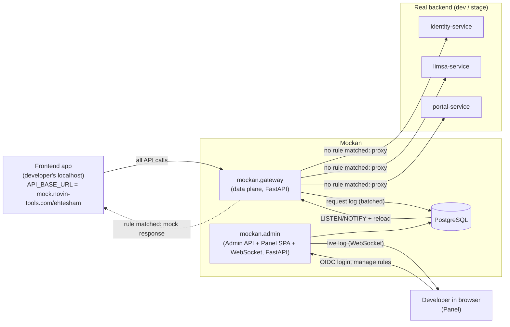
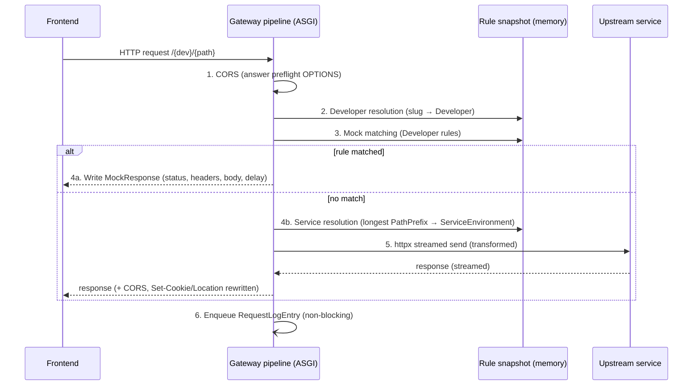
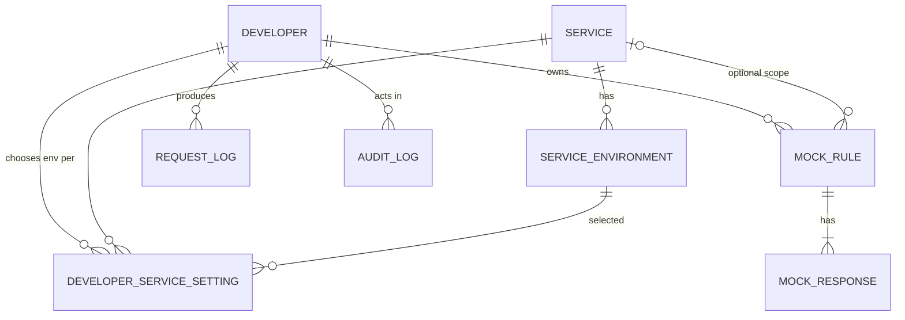

# Mockan — System Architecture

> **One-line summary:** Mockan is an internal, multi-developer mock gateway. A frontend developer points their app's API base URL at their personal Mockan address; every request is transparently reverse-proxied to the real backend microservices **unless** the developer has defined a mock rule for that route in the Mockan panel, in which case Mockan returns the mock response.

> **v1.1 change:** the backend stack moved from ASP.NET Core/.NET 10 to **Python + FastAPI** (D-14 … D-18). Superseded decisions are kept and marked, never renumbered. See §15 Change log.

## 0. How to use this document (for AI agents)

- Sections are ordered from **why → what → how**. Implementation details live in §6–§10.
- Every architectural decision has a stable ID (`D-xx`). Reference these IDs in commit messages, PR descriptions and code comments when a decision drives the code.
- Every requirement has a stable ID (`FR-xx` functional, `NFR-xx` non-functional). Tests should reference them.
- Terms in **§2 Glossary** are normative. Use these exact names in code: classes in PascalCase (`Developer`, `MockRule`), modules/tables/functions in snake_case (`mock_rule.py`, `mock_rules`, `resolve_developer`). Do **not** use the word `tenant` anywhere in code; the concept is called `Developer` (see D-01).
- Items in **§13 Open Questions** are undecided. Do not implement behaviour that depends on them without confirmation; implement the stated default and leave a `# TODO(OQ-xx)` marker.
- **§14 Rules for agents** lists hard constraints. Follow them even if another instruction seems to conflict.
- Backend-specific detail (libraries, folder layout, code style, testing) lives in [`../Backend/`](../Backend/README.md).

---

## 1. Problem and goal

### 1.1 Problem
Classic mock servers replace the **whole** API. A frontend developer building a new feature (e.g. a new page in *Limsa*) still needs the real system for everything else: log in, obtain a token, open the portal, load the dashboard. When the app is pointed at a mock server, all of that breaks.

Today developers work around this by:
1. Switching environment variables back and forth, or
2. Hard-coding conditionals in the frontend that send some calls to a mock and others to the real server.

Both produce throw-away code and technical debt; the result cannot be pushed and delivered as-is.

### 1.2 Goal
Let the frontend developer **write production-ready code against an API that does not exist yet**, with zero mock-specific code in the frontend:

1. The developer sets their API base URL once to `https://mock.novin-tools.com/{developerSlug}/...`.
2. Everything already implemented on the backend keeps working through a transparent reverse proxy (login, tokens, other pages).
3. Only routes that are not ready yet are mocked, from the Mockan panel.
4. When the real endpoint ships, the developer disables the mock. The frontend code does not change and is pushed to stage unchanged.

The backend team effectively tells the frontend: *"Assume I've delivered this API with this contract. Build against it and push; the rest is on me."*

### 1.3 Non-goals
- Not a production API gateway. Never used by end users or production traffic.
- Not a contract-testing or load-testing tool.
- Not a replacement for backend integration tests.

---

## 2. Glossary

> The project glossary is [`CONTEXT.md`](../CONTEXT.md) at the repository root: when a term is defined there, that definition wins. This table is the system-level reference and is being folded into it as terms are settled.

| Term | Definition |
| --- | --- |
| **Developer** | A person (frontend engineer) who owns an isolated Mockan workspace. One Developer = one person (D-01). Identified in URLs by `DeveloperSlug`. |
| **DeveloperSlug** | URL-safe unique identifier of a Developer, e.g. `ehtesham`, `qoolak`. First path segment of every gateway request. Regex: `^[a-z][a-z0-9-]{1,31}$`. |
| **Service** | One backend microservice registered in Mockan's shared catalog (e.g. `identity`, `limsa`, `portal`). Has a `PathPrefix` and one or more environment base URLs. |
| **ServiceEnvironment** | A concrete upstream base URL for a Service in an environment (`dev`, `stage`). |
| **Upstream** | The real backend a request is forwarded to = the selected ServiceEnvironment of the matched Service. |
| **MockRule** | A Developer-owned rule: "when a request matches X, return response Y instead of proxying". |
| **MockResponse** (Scenario) | One named response variant of a MockRule (e.g. `success`, `empty`, `error-500`). Exactly one is active per rule. |
| **Gateway** | The data-plane process that receives frontend traffic, resolves Developer and Service, evaluates MockRules, and either answers or forwards. |
| **Control plane** | Admin API + Panel + database: where Developers, Services and MockRules are managed. |
| **Rule snapshot** | Immutable, pre-compiled, in-memory copy of all rules/services used by the Gateway for matching. |
| **Request log** | Recent requests per Developer with their outcome (`Proxied` / `Mocked` / `Error`). |

---

## 3. Requirements

### 3.1 Functional
| ID | Requirement |
| --- | --- |
| FR-01 | Each Developer has an isolated workspace reachable at `/{developerSlug}/`. Rules of one Developer never affect another. |
| FR-02 | Requests that match no enabled MockRule are reverse-proxied to the correct Service upstream, preserving method, path, query, headers and body. |
| FR-03 | Multiple backend microservices are supported. The Service is resolved from the path after the DeveloperSlug using the longest matching `PathPrefix`. |
| FR-04 | Per Developer, the target environment of each Service can be chosen (default `stage`). |
| FR-05 | MockRule match types: `Exact`, `Template` (`/orders/{id}`), `Prefix`, `Regex`. Optional method filter and optional query/header conditions. |
| FR-06 | A MockRule returns status code, headers, body and an optional artificial delay. |
| FR-07 | A MockRule can have several MockResponses; the Developer switches the active one in the panel without editing it. |
| FR-08 | Rule changes take effect in the Gateway within 2 seconds without a restart. |
| FR-09 | The panel shows the Developer's recent requests (live) and offers "Mock this" to create a rule pre-filled from a real request/response. |
| FR-10 | The panel has a "Test route" tool: given method + path, show which rule matches or which upstream it would be proxied to. |
| FR-11 | Rules can be enabled/disabled individually and all at once. |
| FR-12 | Export / import of a Developer's rules as JSON (for sharing and versioning). |

### 3.2 Non-functional
| ID | Requirement |
| --- | --- |
| NFR-01 | Gateway overhead for a proxied request ≤ 10 ms p95 (excluding upstream time). |
| NFR-02 | Gateway never queries the database on the request path (reads only the in-memory snapshot). |
| NFR-03 | Gateway is stateless and horizontally scalable. |
| NFR-04 | Streaming is preserved: large bodies, file uploads/downloads, SSE and WebSockets pass through without full buffering. |
| NFR-05 | Only reachable from the organisation's internal network/VPN. |
| NFR-06 | Upstreams are restricted to the Service catalog (no open proxy, never production). |
| NFR-07 | Secrets (Authorization headers, cookies, tokens) are masked in logs and the request log. |
| NFR-08 | Regex evaluation is bounded (linear-time engine, bounded pattern and input size; see D-17). |

---

## 4. Architecture decisions

| ID | Decision | Rationale |
| --- | --- | --- |
| D-01 | The isolation unit is a **Developer** (one per person). The term `tenant` is not used. | Each frontend engineer works on their own feature and must not affect others. |
| D-02 | Developer is identified by **path prefix**: `https://mock.novin-tools.com/{developerSlug}/...`. | Matches how the team described usage; one DNS name and one TLS cert. Subdomain mode is a possible later option (OQ-01). |
| D-03 | ~~Stack is ASP.NET Core on .NET 10 (LTS).~~ **Superseded by D-14 (v1.1).** | Was the team standard at v1.0. |
| D-04 | ~~Reverse proxying uses YARP's `IHttpForwarder` (direct forwarding).~~ **Superseded by D-15 (v1.1).** | YARP is .NET-only. |
| D-05 | Split into **data plane (Gateway)** and **control plane (Admin API + Panel)**, deployed as separate processes. | Gateway stays small, fast and independently scalable; admin changes cannot destabilise traffic. |
| D-06 | ~~PostgreSQL accessed via EF Core (Npgsql).~~ **Superseded by D-16 (v1.1).** PostgreSQL remains the single source of truth. | EF Core is .NET-only. |
| D-07 | Gateway keeps an **immutable in-memory rule snapshot**, rebuilt on change notifications via **Postgres `LISTEN/NOTIFY`** (channel `mockan_config_changed`), plus a periodic full reload every 60 s as a safety net. | Satisfies NFR-02 and FR-08 without adding Redis. |
| D-08 | Services are a **shared, admin-managed catalog**; Developers only pick an environment per Service and define MockRules. | Prevents arbitrary upstreams (NFR-06) and avoids every developer re-entering URLs. |
| D-09 | ~~Regex rules use `RegexOptions.NonBacktracking` with a 50 ms match timeout.~~ **Superseded by D-17 (v1.1).** | .NET-only API. |
| D-10 | ~~Request log via bounded `Channel<T>`; live view with SignalR.~~ **Superseded by D-18 (v1.1).** | .NET-only APIs. |
| D-11 | Panel is a **React + TypeScript SPA** (Vite), served as static files by the Admin API host. | Built and maintained comfortably by frontend engineers; one deployable for the control plane. |
| D-12 | Panel/Admin API authentication uses the organisation's **OIDC SSO**. The Gateway itself is unauthenticated but network-restricted. | The Gateway must not interfere with the app's own auth headers; access control is at the network layer (NFR-05). |
| D-13 | Gateway handles **CORS** itself for all responses (mocked and proxied), using each Developer's `AllowedOrigins`. | Browser calls come from `http://localhost:*`; both mock and proxied responses must be readable. |
| D-14 | Backend stack is **Python 3.14 + FastAPI**, served by **Uvicorn** (`uvloop` + `httptools`). Validation and settings use **Pydantic v2** / `pydantic-settings`. Dependencies and environments are managed with **uv**. Gateway and Admin are two FastAPI apps from one Python package, `mockan`. | Team decision (2026-10-03). Async I/O suits a proxy; typed models and generated OpenAPI suit the Admin API. Python 3.14 provides `uuid.uuid7()` in the standard library. |
| D-15 | Reverse proxying uses one shared **`httpx.AsyncClient`** per process: request bodies are streamed (`content=request.stream()`), responses are streamed (`send(..., stream=True)` → `aiter_raw()` → Starlette `StreamingResponse`). WebSockets are bridged with the **`websockets`** client library. Mockan's own pipeline picks the destination per request. | Replaces YARP. Keeps NFR-04 (no full buffering) and gives the pipeline full control over destinations and transforms. |
| D-16 | **PostgreSQL** is accessed through **SQLAlchemy 2.x async ORM + asyncpg**. Schema migrations use **Alembic**. `LISTEN` uses a dedicated asyncpg connection (`add_listener`). | Relational model, JSONB for conditions/headers, built-in `LISTEN/NOTIFY`; SQLAlchemy + Alembic is the mature Python equivalent of EF Core + migrations. |
| D-17 | Regex rules are compiled with **RE2** (`google-re2`), a linear-time engine. Patterns RE2 can't compile (backreferences, lookaround) and patterns longer than 512 characters are rejected when saved. | NFR-08. Python's built-in `re` backtracks and has no timeout. RE2 guarantees linear-time matching, so no per-match timeout is needed (replaces the 50 ms timeout of D-09). |
| D-18 | Request log entries are put on a bounded **`asyncio.Queue`** (`put_nowait`; drop and count when full) and written by a background batch writer. The live view is pushed to the panel over a **FastAPI WebSocket** at `/hubs/request-log`. | Logging never blocks the request path. Native WebSockets avoid a SignalR dependency. |
| D-19 *(accepted 2026-10-05, B8a)* | Live request-log push across processes: after each batch insert the Gateway's writer runs `SELECT pg_notify('mockan_request_logged', '<developerId>:<maxId>')`; the Admin's `/hubs/request-log` hub keeps one `LISTEN` connection and pushes rows `> lastId` to that Developer's sockets. | The Gateway writes logs but the Admin owns the WebSocket; this reuses the mechanism of D-07 and keeps both processes stateless. |

---

## 5. System context



---

## 6. Request lifecycle (Gateway)

### 6.1 URL anatomy

```
https://mock.novin-tools.com/{developerSlug}/{servicePathPrefix}/{rest...}?{query}
                             └── D-02 ──────┘└── FR-03 ──────────┘
```

Example, catalog has Service `limsa` with `PathPrefix = /limsa` and `StripPrefix = false`:

| Incoming | Outcome |
| --- | --- |
| `POST /ehtesham/identity/connect/token` | No rule → proxied to `https://identity.stage.internal/identity/connect/token` |
| `GET /ehtesham/limsa/api/v1/dashboard` | Rule `Exact GET /limsa/api/v1/dashboard` enabled → mock JSON returned |
| `GET /ehtesham/limsa/api/v1/orders/42` | No rule → proxied to Limsa stage |
| `GET /unknown-dev/...` | `404` with Mockan problem+json (`developer_not_found`) |
| `GET /ehtesham/nothing-registered/x` | `502` with Mockan problem+json (`service_not_resolved`) |

> Rules match against the **path after the DeveloperSlug** (e.g. `/limsa/api/v1/dashboard`), so rules are independent of the Mockan host name.

### 6.2 Pipeline



The pipeline is assembled in `mockan/gateway/app.py` (`create_app()`). Steps are **pure ASGI middleware** (classes with `async def __call__(scope, receive, send)`), never Starlette's `BaseHTTPMiddleware`, because `BaseHTTPMiddleware` interferes with streaming and WebSockets. Order, outermost first:

1. Forwarded headers — handled by Uvicorn (`--proxy-headers --forwarded-allow-ips=<ingress CIDRs>`) because the Gateway runs behind the ingress.
2. `RequestLogCaptureMiddleware` — starts timing, captures metadata, enqueues the log entry on completion (D-18; Phase 2, a no-op stub in Phase 1).
3. `MockanCorsMiddleware` (D-13) — looks up the Developer from the first path segment in the snapshot to get `AllowedOrigins`; falls back to the default origins when the slug is unknown, so error responses stay readable by the browser.
4. `DeveloperResolutionMiddleware` — parses the first segment and stores a `MockanContext` in `scope["state"]["mockan"]`; responds `404 developer_not_found` for an unknown or disabled Developer.
5. `MockMatchingMiddleware` — evaluates rules with `mockan.matching`; short-circuits with the mock response if matched.
6. Proxy endpoint (`ProxyForwarder`) — resolves the Service, builds the destination, streams the request through `httpx` (HTTP) or bridges it with `websockets` (WebSocket).

Health endpoints `/_mockan/health/live` and `/_mockan/health/ready` are FastAPI routes dispatched before step 4. The slug `_mockan` and any slug starting with `_` are reserved.

### 6.3 Proxy transform rules (`ProxyTransformer`, `mockan/gateway/proxy/transform.py`)

| Concern | Rule |
| --- | --- |
| Path | Remove `/{developerSlug}`. If `Service.StripPrefix`, also remove the Service `PathPrefix`. Append to the ServiceEnvironment `BaseUrl`. |
| Query | Forward unchanged (raw query string, no re-encoding). |
| `Host` | Set to upstream host (do not forward Mockan's host). |
| Hop-by-hop headers | Drop `Connection`, `Keep-Alive`, `Proxy-*`, `TE`, `Trailer`, `Transfer-Encoding`, `Upgrade` (and any header named in `Connection`) in both directions. Also drop `Expect` on requests and `Date`/`Server` on responses (the ASGI server adds its own). |
| `X-Forwarded-For/Proto/Host`, `X-Forwarded-Prefix` | `Proto`, `Host` and `Prefix` are set, replacing anything the client sent; `Prefix = /{developerSlug}`. `For` extends the incoming chain with the client address (not repeating it when the chain already ends with it). |
| `X-Mockan-Developer` | Added to the upstream request (helps backend log correlation). |
| `ServiceEnvironment.ExtraHeaders` | Added to the upstream request. |
| `Origin`, `Referer` | Forwarded unchanged by default; Service flag `RewriteOrigin` replaces with the upstream origin if a backend rejects foreign origins. |
| Body | Streamed in both directions; never read fully into memory. Response bytes are passed through raw (`aiter_raw()`), so `Content-Encoding` is preserved and nothing is decompressed. |
| Redirects | The httpx client never follows redirects (`follow_redirects=False`); 3xx responses go back to the browser. |
| `Location` | On any status (a `201 Created` leaks the upstream like a `302`): if it points to the upstream origin (absolute, protocol-relative, or path-absolute `/x`), rewrite to `{MOCKAN_PUBLIC_BASE_URL}/{developerSlug}{PathPrefix?}...`; `PathPrefix` is included only with `StripPrefix`, and the environment's `BaseUrl` path is dropped. Path-relative values and other origins are untouched. |
| `Set-Cookie` | Remove `Domain` attribute; move `Path` under `/{developerSlug}` (no `Path` → `/{developerSlug}`), using the same mapping as `Location` (with `StripPrefix` the Service prefix is inserted too); keep `Secure`/`HttpOnly`; `SameSite=None` cookies stay as-is. Apps use bearer tokens (OQ-02), so cookies are not on the critical path. |
| Upstream CORS headers | Stripped and replaced by Mockan's CORS headers (D-13). |
| Response header `X-Mockan-Source` | `proxy` or `mock` on every response, plus `X-Mockan-Rule-Id` when mocked. Exposed via `Access-Control-Expose-Headers`. |
| Timeouts | `ServiceEnvironment.TimeoutSeconds` (default 100 s) as the httpx connect/read/write/pool timeout, i.e. the longest silence allowed, not a total duration; on timeout return `504` problem+json (`upstream_timeout`). |
| Errors | Connection errors (`httpx.ConnectError` etc.) → `502` problem+json with `code = upstream_unreachable`. |
| Allowlist | Before sending, the destination host is checked against `MOCKAN_ALLOWED_UPSTREAM_HOSTS` again (defence in depth; §14 rule 4). |

### 6.4 CORS (D-13)
- Preflight (`OPTIONS` with `Access-Control-Request-Method`) is answered by Mockan with `204`, never forwarded.
- `Access-Control-Allow-Origin` echoes the request `Origin` if it matches the Developer's `AllowedOrigins` (glob, default `http://localhost:*`, `http://127.0.0.1:*`).
- `Access-Control-Allow-Credentials: true`, allow all requested methods/headers, `Access-Control-Max-Age: 600`.

---

## 7. Mock matching

All matching code lives in `mockan.matching` (pure Python; no FastAPI, Starlette or SQLAlchemy imports, §14 rule 5).

### 7.1 Match types

| `MatchType` | Pattern example | Matches |
| --- | --- | --- |
| `Exact` | `/limsa/api/v1/dashboard` | Exactly that path (case-insensitive, trailing slash ignored). |
| `Template` | `/limsa/api/v1/orders/{id}` | Mockan template syntax: literal segments match case-insensitively; `{name}` matches exactly one non-empty segment; `{*name}` as the **last** segment matches the rest of the path (zero or more segments). Captured values are available to the response template (Phase 2). |
| `Prefix` | `/limsa/api/v1/reports/` | Any path starting with it (case-insensitive). |
| `Regex` | `^/limsa/api/v1/(items|goods)/\d+$` | RE2 syntax, compiled with `google-re2`, max 512 characters (D-17). Search semantics; anchor with `^…$` for a full match. |

Optional extra conditions (all must hold): `Method` (or `ANY`), `QueryConditions` (key = value / key exists), `HeaderConditions` (key = value / key exists; header names case-insensitive). Body conditions are out of scope until phase 3.

### 7.2 Precedence algorithm

```python
TYPE_RANK = {MatchType.EXACT: 0, MatchType.TEMPLATE: 1, MatchType.PREFIX: 2, MatchType.REGEX: 3}

candidates = [r for r in snapshot.rules_for(developer_id) if r.is_enabled]
matches = [r for r in candidates
           if method_matches(r, req) and path_matches(r, req) and conditions_match(r, req)]
winner = min(
    matches,
    key=lambda r: (
        r.priority,             # lower number = higher priority, default 100
        TYPE_RANK[r.match_type],
        -len(r.pattern),        # longest pattern wins
        r.created_at,           # older rule wins
    ),
    default=None,
)
# winner is None -> proxy; otherwise respond with winner.active_response
```

The snapshot pre-groups rules per Developer and pre-compiles regexes and templates when it is built, so matching does no compilation or heavy allocation per request.

### 7.3 Mock response rendering
- Phase 1 (MVP): static `StatusCode`, `Headers` (JSON object), `Body` (string, typically JSON), `ContentType` (default `application/json`), `DelayMs` (0–30000, applied with `asyncio.sleep`, never a blocking sleep).
- Phase 2: `BodyMode = Template` using **Jinja2 `SandboxedEnvironment`**, with access to `request.path`, `request.query`, `request.headers`, `route.<param>` and **Faker**-backed fake-data helpers. (v1.0 named Scriban and Bogus, which are .NET libraries.)
- Phase 3: `BodyMode = ProxyAndPatch` — forward to upstream, then apply a JSON Merge Patch (RFC 7396) to the real response.

---

## 8. Data model

PostgreSQL, schema `mockan`, snake_case tables. SQLAlchemy 2 ORM models (typed `Mapped[...]` declarative classes) live in `mockan.infrastructure.db.models`; enums and value objects live in `mockan.domain`. All ids are `uuid` (UUIDv7 generated in app with `uuid.uuid7()`), except log tables which use `bigint identity`. All tables have `created_at`, `updated_at` (`timestamptz`). Enum columns are stored as `varchar` with a `CHECK` constraint (easier to extend in Alembic than native PG enums).



| Table | Columns (type) | Notes |
| --- | --- | --- |
| `developers` | `id`, `slug` (varchar 32, unique, nullable until chosen), `display_name`, `sso_subject` (unique), `allowed_origins` (jsonb string[]), `is_enabled` (bool), `is_admin` (bool) | Created on first SSO login; slug chosen once. |
| `services` | `id`, `name` (unique, e.g. `limsa`), `path_prefix` (unique, e.g. `/limsa`), `strip_prefix` (bool), `rewrite_origin` (bool), `default_environment` (varchar, default `stage`) | Admin-managed catalog (D-08). |
| `service_environments` | `id`, `service_id` FK, `environment` (`dev`/`stage`), `base_url`, `timeout_seconds` (int, default 100), `extra_headers` (jsonb) | Unique (`service_id`, `environment`). `base_url` host must be in the configured allowlist (NFR-06). |
| `developer_service_settings` | `developer_id` FK, `service_id` FK, `service_environment_id` FK | PK (`developer_id`, `service_id`). Absent row = Service default environment. |
| `mock_rules` | `id`, `developer_id` FK, `service_id` FK nullable, `name`, `method` (varchar, `ANY` allowed), `match_type` (enum), `pattern`, `query_conditions` (jsonb), `header_conditions` (jsonb), `priority` (int, default 100), `is_enabled` (bool), `active_response_id` FK nullable | Index (`developer_id`, `is_enabled`). |
| `mock_responses` | `id`, `rule_id` FK, `name`, `status_code` (int), `headers` (jsonb), `content_type`, `body` (text), `body_mode` (enum `Static`/`Template`/`ProxyAndPatch`), `delay_ms` (int) | |
| `request_logs` | `id` (bigint identity), `developer_id`, `timestamp`, `method`, `path`, `query`, `service_id` nullable, `source` (`Proxied`/`Mocked`/`Error`), `rule_id` nullable, `status_code`, `duration_ms`, `request_headers` (jsonb, masked), `response_headers` (jsonb, masked), `request_body_sample`, `response_body_sample` (text, max 16 KB each) | Phase 2. Retention: last 7 days **and** max 5,000 rows per Developer, enforced by a background cleanup job. |
| `audit_logs` | `id` (bigint identity), `developer_id` (actor), `timestamp`, `action` (`create`/`update`/`delete`/`toggle`/`activate`), `entity_type` (`mock_rule`/`mock_response`/`service`/`service_environment`/`developer_service_setting`/`developer`), `entity_id`, `changes` (jsonb, masked) | Added in v1.1 to make PRD PR-15 "audit log (who, when, what)" concrete. Written in the same transaction as the change. |

Change notification: a SQLAlchemy session event hook in `mockan.infrastructure` collects the affected Developer ids (or `catalog`) from the session's new/dirty/deleted objects for the tables `developers`, `services`, `service_environments`, `developer_service_settings`, `mock_rules`, `mock_responses`, and in `before_commit` runs `SELECT pg_notify('mockan_config_changed', :payload)` once per distinct payload (`<developerId>` or `catalog`). PostgreSQL delivers the notification only if the transaction commits.

---

## 9. Solution structure (Python)

```text
Mockan/
├── Agent/                          # Cross-cutting docs (this file).
├── Product/                        # PRD and product docs.
├── Backend/                        # Backend docs (C-01): stack, structure, conventions, testing.
├── Frontend/                       # Panel docs (C-01).
├── server/                         # Python backend: one uv project, one package `mockan`.
│   ├── pyproject.toml              # Dependencies + ruff, mypy, pytest, import-linter config.
│   ├── uv.lock
│   ├── alembic.ini
│   ├── migrations/                 # Alembic env.py + versions/.
│   ├── src/mockan/
│   │   ├── domain/                 # Enums, constants, value objects, validation rules. Standard library only.
│   │   ├── matching/               # Pure matching engine: RuleSnapshot, compilers, precedence (§7). No FastAPI/Starlette/SQLAlchemy.
│   │   ├── infrastructure/         # Settings, SQLAlchemy models + session, NOTIFY hook, snapshot loader, request-log writer.
│   │   ├── gateway/                # FastAPI app: ASGI pipeline (§6), ProxyForwarder (httpx/websockets), ProxyTransformer,
│   │   │                           #   SnapshotService (LISTEN + periodic reload), request-log queue.
│   │   └── admin/                  # FastAPI app: Admin REST API (§10), OIDC auth, WebSocket hub, serves Panel static files.
│   └── tests/
│       ├── matching/               # Unit tests for every match type and precedence rule (pytest).
│       ├── gateway/                # ASGI app + fake upstream (real Uvicorn server) integration tests.
│       └── admin/                  # API tests with Testcontainers PostgreSQL.
├── panel/                          # React + TypeScript + Vite SPA. Build output copied to server/src/mockan/admin/static/.
└── deploy/
    ├── docker/                     # Dockerfiles for Gateway and Admin.
    └── compose/                    # docker-compose for local development.
```

> The code folder is `server/`, not `backend/`, so it can't collide with the `Backend/` docs folder on case-insensitive file systems (macOS, Windows).

Allowed import directions (enforced by `import-linter` in CI): `domain` ← `matching` ← `infrastructure` ← {`gateway`, `admin`}. `gateway` and `admin` never import each other. Details in [`../Backend/project-structure.md`](../Backend/project-structure.md).

Key packages (pinned in `server/pyproject.toml`; versions in [`../Backend/tech-stack.md`](../Backend/tech-stack.md)): `fastapi`, `uvicorn[standard]`, `pydantic`, `pydantic-settings`, `httpx`, `websockets`, `sqlalchemy[asyncio]`, `asyncpg`, `alembic`, `google-re2`, `authlib`, `structlog`, `opentelemetry-sdk` + FastAPI/httpx instrumentation, `jinja2` + `faker` (phase 2); dev: `pytest`, `pytest-asyncio`, `testcontainers[postgres]`, `ruff`, `mypy`, `import-linter`.

Gateway snapshot mechanics:
- `RuleSnapshotProvider.current` returns the current immutable `RuleSnapshot`. A rebuild creates a new snapshot object and swaps it with a single attribute assignment (atomic under CPython); request handlers read `current` once per request and never mutate it.
- `SnapshotService` (started in the FastAPI lifespan) opens a dedicated asyncpg connection, runs `LISTEN mockan_config_changed` via `add_listener`, debounces notifications for 200 ms, rebuilds the affected Developer's slice (or everything for `catalog`), and swaps the snapshot. It also does a full reload every 60 s (D-07) and reconnects with backoff if the connection drops.
- If the database is unreachable the Gateway keeps serving the last good snapshot and reports `ready = degraded`.
- Each Uvicorn worker process has its own snapshot and LISTEN connection; this keeps workers stateless (NFR-03).

---

## 10. Admin API (control plane)

Base path `/api/v1`, JSON, FastAPI routers with Pydantic request/response models (OpenAPI generated at `/api/v1/openapi.json`). Auth: OIDC session cookie for the Panel, or OIDC bearer token for API clients (D-12). Developers can only access their own resources; `is_admin` users manage the Service catalog. Errors use RFC 7807 problem+json.

| Method | Route | Purpose |
| --- | --- | --- |
| GET | `/auth/login` · `/auth/callback` · POST `/auth/logout` | OIDC authorization-code flow (Authlib) that sets/clears the Panel session cookie. |
| GET | `/me` | Current Developer (creates on first login, slug selection flow if missing). |
| PUT | `/me` | Update display name, `allowedOrigins`; set slug once if missing. |
| GET | `/services` | Service catalog with environments (read for all). |
| POST/PUT/DELETE | `/services[/{id}]`, `/services/{id}/environments[/{envId}]` | Catalog management (admin only). |
| GET/PUT | `/me/service-settings` | Choose environment per Service (FR-04). |
| GET/POST | `/me/rules` | List / create MockRules. |
| GET/PUT/DELETE | `/me/rules/{ruleId}` | Read / update / delete a rule. |
| POST | `/me/rules/{ruleId}/toggle` | Enable/disable (FR-11). |
| POST | `/me/rules/toggle-all` | Enable/disable all (FR-11). |
| POST/PUT/DELETE | `/me/rules/{ruleId}/responses[/{responseId}]` | Manage MockResponses (FR-07). |
| POST | `/me/rules/{ruleId}/responses/{responseId}/activate` | Switch active response. |
| POST | `/me/test-route` | Body `{method, path, headers?, query?}` → which rule matches or which upstream URL (FR-10). Uses `mockan.matching`. |
| GET | `/me/request-logs?cursor=&source=&path=` | Paged request log. |
| POST | `/me/request-logs/{id}/create-rule` | Create a rule pre-filled from a logged request/response (FR-09). |
| GET | `/me/rules/export` · POST `/me/rules/import` | JSON export/import (FR-12). |
| WebSocket | `/hubs/request-log` | Live stream of the caller's request log entries (D-18). |

JSON field names in the API are camelCase (Pydantic `alias_generator=to_camel`, `populate_by_name=True`); Python attributes and DB columns are snake_case. Payload shapes, limits, error codes and auth details are in [`../Backend/admin-api.md`](../Backend/admin-api.md).

Validation rules (enforce in Pydantic models / services, test in `server/tests/admin`):
- `pattern` must start with `/` for `Exact`/`Template`/`Prefix`; regexes must compile with RE2 and be ≤ 512 characters (D-17); templates must parse (`{*name}` only as last segment).
- `status_code` 100–599; `delay_ms` 0–30000; `body` ≤ 1 MB.
- `slug` matches `^[a-z][a-z0-9-]{1,31}$`, not reserved (`_*`, `api`, `hubs`, `health`).
- ServiceEnvironment `base_url` host is in `MOCKAN_ALLOWED_UPSTREAM_HOSTS`.

---

## 11. Panel (frontend) screens

| Screen | Contents |
| --- | --- |
| Onboarding | Choose slug; shows the base URL to put in `.env`, e.g. `VITE_API_BASE_URL=https://mock.novin-tools.com/ehtesham`. |
| Services | Table of catalog Services with an environment dropdown per Service. |
| Rules | List with enable switch, method, match type, pattern, active response; "disable all" switch. |
| Rule editor | Match settings, conditions, responses as tabs, JSON editor (Monaco) with validation, delay slider. |
| Live log | Real-time table (WebSocket) with `Proxied`/`Mocked` badge, filter, details drawer, **Mock this** button. |
| Test route | Method + path input → matched rule or upstream URL. |

---

## 12. Security, operations and deployment

### 12.1 Security
- Gateway and Admin are exposed only on the internal network / VPN (NFR-05). Ingress restricts source IP ranges.
- Upstream host allowlist from configuration (`MOCKAN_ALLOWED_UPSTREAM_HOSTS`); production hosts are never allowed (NFR-06).
- Request log masks `Authorization`, `Cookie`, `Set-Cookie`, and any header/JSON field whose name matches `(?i)(token|secret|password|api[-_]?key)` (NFR-07). The same masking applies to application logs (structlog processor) and `audit_logs.changes`.
- Admin API: OIDC SSO, per-Developer authorisation on every `/me/*` route (FastAPI dependency `current_developer`), admin role for catalog changes (`require_admin`), audit log of rule changes (`who`, `when`, `what`) in `audit_logs`.

### 12.2 Observability
- `structlog` structured logs (JSON) with `developer`, `service`, `source`, `rule_id`, `trace_id`.
- OpenTelemetry traces and metrics (`opentelemetry-instrumentation-fastapi`, `-httpx`): `mockan_requests_total{source}`, `mockan_proxy_duration_ms`, `mockan_snapshot_age_seconds`, `mockan_request_log_dropped_total`.
- Distributed tracing headers (`traceparent`) are forwarded to upstreams.

### 12.3 Deployment
- Two container images built from `server/`: `mockan-gateway`, `mockan-admin` (Admin image includes the built Panel). Base image `python:3.14-slim`, dependencies installed with `uv sync --frozen --no-dev`.
- Entry points:
  - Gateway: `uvicorn mockan.gateway.app:create_app --factory --host 0.0.0.0 --port 8080 --proxy-headers --forwarded-allow-ips=<ingress CIDRs>` (the image sets `FORWARDED_ALLOW_IPS` instead of the flag; Uvicorn reads it)
  - Admin: `uvicorn mockan.admin.app:create_app --factory --host 0.0.0.0 --port 8081 --proxy-headers`
- Ingress routing on `mock.novin-tools.com`: `/_mockan/admin/*` and `/api/v1/*`, `/hubs/*` → Admin; everything else → Gateway. (Alternatively host the panel at `mockan.novin-tools.com`; see OQ-03.)
- Local stack: `deploy/compose/docker-compose.yml` (postgres, admin + Panel, 2 Gateway replicas, optional demo upstream); see [`../Backend/operations.md`](../Backend/operations.md).
- Gateway: ≥ 2 replicas, readiness requires a loaded snapshot. Admin: 1–2 replicas.
- PostgreSQL: existing internal cluster; Alembic migrations (`alembic upgrade head`) applied by the Admin on startup in non-prod (`MOCKAN_MIGRATE_ON_STARTUP=true`), by a migration job in shared environments.
- Configuration via environment variables (prefix `MOCKAN_`, loaded with `pydantic-settings`, optional `.env` for local dev); secrets from the platform secret store. Core settings:

| Variable | Used by | Example / default |
| --- | --- | --- |
| `MOCKAN_DATABASE_URL` | both | `postgresql+asyncpg://mockan:***@db:5432/mockan` |
| `MOCKAN_ALLOWED_UPSTREAM_HOSTS` | both | `["identity.stage.internal","*.dev.internal"]` (JSON list; `*.` wildcard allowed) |
| `MOCKAN_PUBLIC_BASE_URL` | both | `https://mock.novin-tools.com` (Location rewrite, base URL shown in panel) |
| `MOCKAN_DEFAULT_ALLOWED_ORIGINS` | both | `["http://localhost:*","http://127.0.0.1:*"]` |
| `MOCKAN_OIDC_ISSUER`, `MOCKAN_OIDC_CLIENT_ID`, `MOCKAN_OIDC_CLIENT_SECRET` | admin | generic OIDC (`# TODO(OQ-04)`) |
| `MOCKAN_SESSION_SECRET` | admin | random 32+ bytes |
| `MOCKAN_ADMIN_SSO_SUBJECTS` | admin | bootstrap list of `sso_subject`s that get `is_admin=true` on first login |
| `MOCKAN_MIGRATE_ON_STARTUP` | admin | `false` |
| `MOCKAN_SNAPSHOT_RELOAD_SECONDS` | gateway | `60` |
| `MOCKAN_SNAPSHOT_DEBOUNCE_MS` | gateway | `200` (coalesce `LISTEN` notifications before rebuilding) |
| `MOCKAN_REQUEST_LOG_QUEUE_SIZE` | gateway | `10000` (bounded queue; a full queue drops the entry and counts it) |
| `MOCKAN_REQUEST_LOG_BATCH_SIZE`, `MOCKAN_REQUEST_LOG_FLUSH_MS` | gateway | `200`, `500` (the writer inserts a batch when it has this many entries or this long has passed) |
| `MOCKAN_REQUEST_LOG_RETENTION_DAYS`, `MOCKAN_REQUEST_LOG_MAX_ROWS_PER_DEVELOPER`, `MOCKAN_REQUEST_LOG_CLEANUP_SECONDS` | gateway | `7`, `5000`, `600` (retention job) |
| `MOCKAN_OTEL_ENDPOINT`, `MOCKAN_OTEL_EXPORT_INTERVAL_SECONDS`, `MOCKAN_TRACING_ENABLED` | both | empty, `30`, `false` (OTLP/HTTP collector for metrics and spans; tracing is opt-in because it changes the `traceparent` sent upstream to a child span) |
| `MOCKAN_AUTH_MODE` | admin | `oidc` (default) or `dev`: local login without an identity provider; MUST NOT be used in shared environments |
| `MOCKAN_PANEL_BASE_PATH` | admin | `/` (where the built Panel is mounted; `# TODO(OQ-03)`) |
| `MOCKAN_LOG_LEVEL` | both | `INFO` |
| `MOCKAN_LOG_FORMAT` | both | `json` (default) or `console` |

### 12.4 Delivery phases

| Phase | Scope | Exit criteria |
| --- | --- | --- |
| **1 — MVP** | Developer workspaces, Service catalog with dev/stage, transparent proxy with transforms + CORS, rule types Exact/Prefix/Regex/Template, static responses with delay, Admin API, basic Panel, LISTEN/NOTIFY reload, audit log, health endpoints. | A frontend developer logs in to a real app through Mockan, mocks one unreleased endpoint, and pushes code with no mock-specific changes. Covers FR-01…FR-08, FR-11. |
| **2 — Productivity** | Multiple responses per rule, request log + live view + "Mock this", test-route tool, templated bodies (Jinja2 sandbox + Faker), export/import. | FR-07, FR-09, FR-10, FR-12 done. |
| **3 — Contract-driven** | Import backend OpenAPI specs to generate rules; ProxyAndPatch mode; diff alert when a real endpoint starts responding differently from the mock; optional shared rule sets between Developers. | Agreed after phase 2 feedback. |

---

## 13. Open questions

| ID | Question | Current default |
| --- | --- | --- |
| OQ-01 | Path-based (`/{slug}/`) vs subdomain (`{slug}.mock.novin-tools.com`) identification? Subdomains avoid cookie-path rewriting. | Path-based (D-02). |
| OQ-02 | Do our apps authenticate with bearer tokens in headers or with cookies? | **Resolved 2026-10-05: bearer tokens.** The Set-Cookie rewrite in §6.3 stays as specified; cookie-based apps (`SameSite=None; Secure`, `__Host-`) are not supported. |
| OQ-03 | Panel on the same host under `/_mockan/admin` or a separate host `mockan.novin-tools.com`? | Separate host is preferred if DNS/TLS is easy; otherwise same host. |
| OQ-04 | Which OIDC provider (Keycloak, Azure AD, other)? | Generic OIDC configuration (Authlib, discovery via `MOCKAN_OIDC_ISSUER`). |
| OQ-05 | Do frontends call one shared API gateway URL or one base URL per microservice? Both are supported by `PathPrefix` + `StripPrefix`; confirm per app to configure the catalog. | Both supported. |

---

## 14. Rules for agents implementing Mockan

1. Use the glossary names exactly (`Developer`, `Service`, `ServiceEnvironment`, `MockRule`, `MockResponse`). Never introduce `Tenant`.
2. The Gateway request path must never hit the database (NFR-02). Read only from `RuleSnapshotProvider.current`.
3. Never buffer full request/response bodies on the proxy path (no `await request.body()`, no `response.aread()` in the Gateway); request-log body samples are captured from a bounded peek (≤ 16 KB) without breaking streaming.
4. Never forward to a host outside `MOCKAN_ALLOWED_UPSTREAM_HOSTS`.
5. Keep `mockan.matching` free of FastAPI, Starlette and SQLAlchemy imports so it can be unit-tested and reused by `/me/test-route`. `import-linter` enforces this.
6. Every matching or transform change needs unit tests in `server/tests/matching` or integration tests in `server/tests/gateway` referencing the relevant `FR-`/`NFR-` IDs.
7. Every Gateway response carries `X-Mockan-Source`.
8. Mockan-generated errors are RFC 7807 problem+json with a stable `code` field (`developer_not_found`, `service_not_resolved`, `upstream_unreachable`, `upstream_timeout`, `mock_render_failed`).
9. If a change contradicts a `D-xx` decision, stop and propose an updated decision instead of silently deviating.
10. Never block the event loop on the Gateway request path: no synchronous I/O, no `time.sleep`, no CPU-heavy work per request (compilation happens when the snapshot is built).

---

## 15. Change log

| Version | Date | Change |
| --- | --- | --- |
| v1.0 | 2026-10-03 | Approved baseline (ASP.NET Core / .NET 10). |
| v1.1 | 2026-10-03 | Backend stack changed to Python 3.14 + FastAPI. D-03, D-04, D-06, D-09, D-10 superseded by D-14 … D-18. Rewrote §6.2 pipeline, §6.3 transformer, §7 template/regex semantics, §9 structure, §12.3 deployment/config for Python. Phase 2 templating moved from Scriban/Bogus to Jinja2 sandbox/Faker. SignalR replaced by WebSocket. Added `audit_logs` table (PR-15), `/auth/*` routes, hop-by-hop/allowlist transform rows, §14 rule 10. NFR-08 wording updated (no per-match timeout with RE2). |
| v1.2 | 2026-10-04 | Phase 1 complete (B0–B7). Backend implementation plan gaps settled: G-1 validation `errors` map; G-2 Admin payload shapes ([`../Backend/admin-api.md`](../Backend/admin-api.md)); G-3 `409 last_response`; G-4 `publicBaseUrl` on `GET /me`; G-5 new error codes; G-6 `X-Mockan-Source: error` on problems, `mock` on preflight; G-7 `mock_rules.service_id` informational; G-8 readiness `starting`/`ready`/`degraded`; G-9 `MOCKAN_AUTH_MODE=dev`; G-11 Panel served by the Admin; G-12 CSRF via JSON-only writes + `SameSite=Lax`; G-13 `bodyMode` Static only. New settings in §12.3: `MOCKAN_AUTH_MODE`, `MOCKAN_PANEL_BASE_PATH`, `MOCKAN_SNAPSHOT_DEBOUNCE_MS`, `MOCKAN_LOG_LEVEL`, `MOCKAN_LOG_FORMAT`. Proposed **D-19** (G-10, request-log push across processes; needs approval before B8). OQ-B1 … OQ-B6 recorded in the backend plan. |
| v1.3 | 2026-10-05 | Phase 2 backend built (B8). D-19 accepted. New settings in §12.3: `MOCKAN_REQUEST_LOG_*` (queue, batch, flush, retention), `MOCKAN_OTEL_*`, `MOCKAN_TRACING_ENABLED`. `request_logs` table (migration 0002). New Admin routes in [`../Backend/admin-api.md`](../Backend/admin-api.md): `/me/request-logs`, `/me/request-logs/{id}/create-rule`, `/hubs/request-log`, `/me/test-route`, `/me/rules/export`, `/me/rules/import`. `bodyMode: Template` is accepted (Jinja2 sandbox + Faker; `mock_render_failed`). Tracing is opt-in so the client's `traceparent` still reaches upstreams unchanged by default. |
