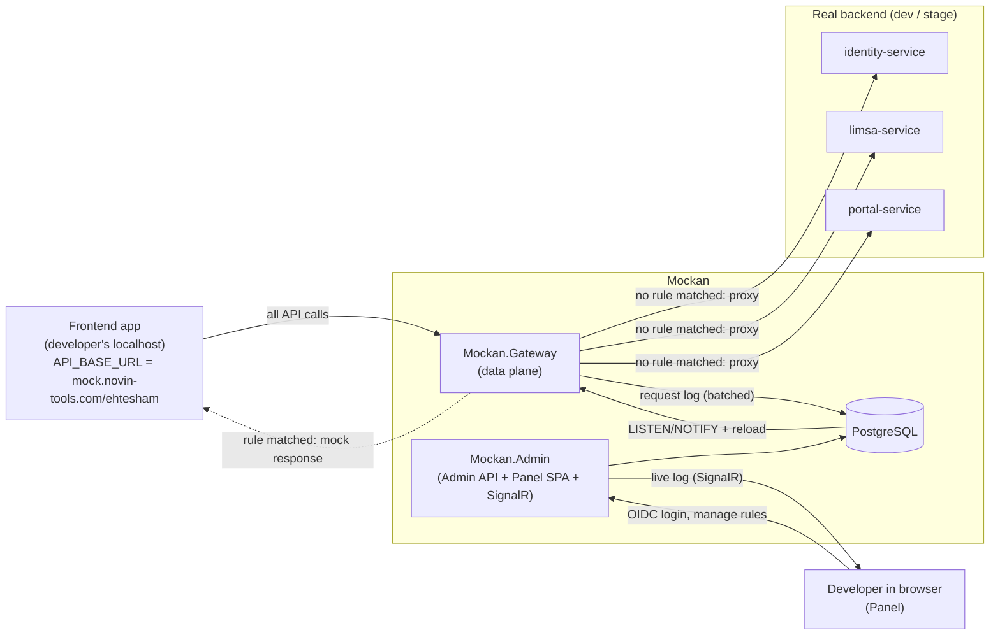
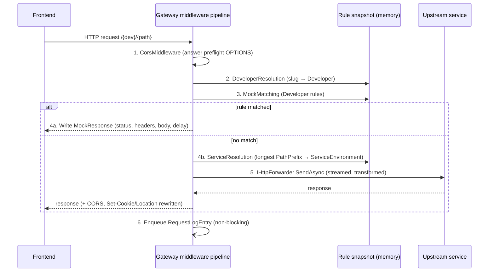
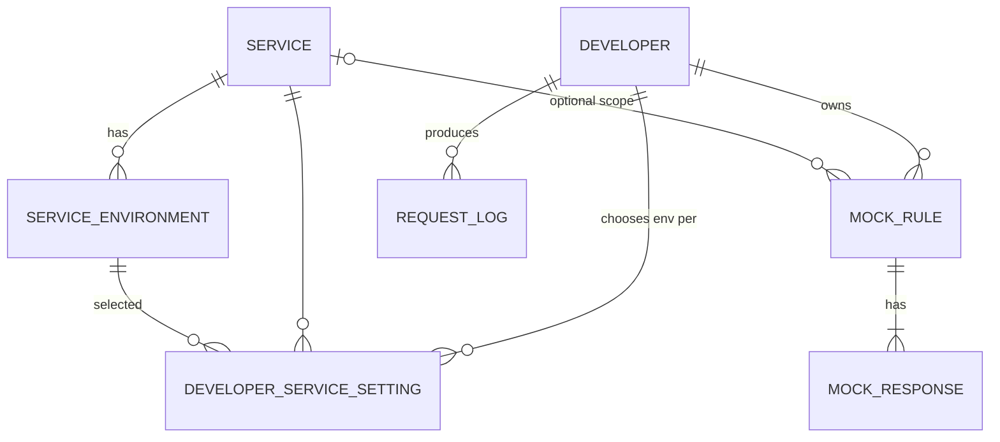

# Mockan — System Architecture

> **One-line summary:** Mockan is an internal, multi-developer mock gateway. A frontend developer points their app's API base URL at their personal Mockan address; every request is transparently reverse-proxied to the real backend microservices **unless** the developer has defined a mock rule for that route in the Mockan panel, in which case Mockan returns the mock response.

## 0. How to use this document (for AI agents)

- Sections are ordered from **why → what → how**. Implementation details live in §6–§10.
- Every architectural decision has a stable ID (`D-xx`). Reference these IDs in commit messages, PR descriptions and code comments when a decision drives the code.
- Every requirement has a stable ID (`FR-xx` functional, `NFR-xx` non-functional). Tests should reference them.
- Terms in **§2 Glossary** are normative. Use these exact names in code (class names, table names, API routes). Do **not** use the word `tenant` anywhere in code; the concept is called `Developer` (see D-01).
- Items in **§13 Open Questions** are undecided. Do not implement behaviour that depends on them without confirmation; implement the stated default and leave a `// TODO(OQ-xx)` marker.
- **§14 Rules for agents** lists hard constraints. Follow them even if another instruction seems to conflict.

---

## 1. Problem and goal

### 1.1 Problem
Classic mock servers replace the **whole** API. A frontend developer building a new feature (e.g. a new page in *Limsa*) still needs the real system for everything else: log in, obtain a token, open the portal, load the dashboard. When the app is pointed at a mock server, all of that breaks.

Today developers work around this by:
1. Switching environment variables back and forth, or
2. Hard-coding conditionals in the frontend that send some calls to a mock and others to the real server.

Both produce throw-away code and technical debt; the result cannot be pushed and delivered as-is.

### 1.2 Goal
Let the frontend developer **write production-ready code against an API that does not exist yet**, with zero mock-specific code in the frontend:

1. The developer sets their API base URL once to `https://mock.novin-tools.com/{developerSlug}/...`.
2. Everything already implemented on the backend keeps working through a transparent reverse proxy (login, tokens, other pages).
3. Only routes that are not ready yet are mocked, from the Mockan panel.
4. When the real endpoint ships, the developer disables the mock. The frontend code does not change and is pushed to stage unchanged.

The backend team effectively tells the frontend: *"Assume I've delivered this API with this contract. Build against it and push; the rest is on me."*

### 1.3 Non-goals
- Not a production API gateway. Never used by end users or production traffic.
- Not a contract-testing or load-testing tool.
- Not a replacement for backend integration tests.

---

## 2. Glossary

| Term | Definition |
| --- | --- |
| **Developer** | A person (frontend engineer) who owns an isolated Mockan workspace. One Developer = one person (D-01). Identified in URLs by `DeveloperSlug`. |
| **DeveloperSlug** | URL-safe unique identifier of a Developer, e.g. `ehtesham`, `qoolak`. First path segment of every gateway request. Regex: `^[a-z][a-z0-9-]{1,31}$`. |
| **Service** | One backend microservice registered in Mockan's shared catalog (e.g. `identity`, `limsa`, `portal`). Has a `PathPrefix` and one or more environment base URLs. |
| **ServiceEnvironment** | A concrete upstream base URL for a Service in an environment (`dev`, `stage`). |
| **Upstream** | The real backend a request is forwarded to = the selected ServiceEnvironment of the matched Service. |
| **MockRule** | A Developer-owned rule: "when a request matches X, return response Y instead of proxying". |
| **MockResponse** (Scenario) | One named response variant of a MockRule (e.g. `success`, `empty`, `error-500`). Exactly one is active per rule. |
| **Gateway** | The data-plane process that receives frontend traffic, resolves Developer and Service, evaluates MockRules, and either answers or forwards. |
| **Control plane** | Admin API + Panel + database: where Developers, Services and MockRules are managed. |
| **Rule snapshot** | Immutable, pre-compiled, in-memory copy of all rules/services used by the Gateway for matching. |
| **Request log** | Recent requests per Developer with their outcome (`Proxied` / `Mocked` / `Error`). |

---

## 3. Requirements

### 3.1 Functional
| ID | Requirement |
| --- | --- |
| FR-01 | Each Developer has an isolated workspace reachable at `/{developerSlug}/`. Rules of one Developer never affect another. |
| FR-02 | Requests that match no enabled MockRule are reverse-proxied to the correct Service upstream, preserving method, path, query, headers and body. |
| FR-03 | Multiple backend microservices are supported. The Service is resolved from the path after the DeveloperSlug using the longest matching `PathPrefix`. |
| FR-04 | Per Developer, the target environment of each Service can be chosen (default `stage`). |
| FR-05 | MockRule match types: `Exact`, `Template` (`/orders/{id}`), `Prefix`, `Regex`. Optional method filter and optional query/header conditions. |
| FR-06 | A MockRule returns status code, headers, body and an optional artificial delay. |
| FR-07 | A MockRule can have several MockResponses; the Developer switches the active one in the panel without editing it. |
| FR-08 | Rule changes take effect in the Gateway within 2 seconds without a restart. |
| FR-09 | The panel shows the Developer's recent requests (live) and offers "Mock this" to create a rule pre-filled from a real request/response. |
| FR-10 | The panel has a "Test route" tool: given method + path, show which rule matches or which upstream it would be proxied to. |
| FR-11 | Rules can be enabled/disabled individually and all at once. |
| FR-12 | Export / import of a Developer's rules as JSON (for sharing and versioning). |

### 3.2 Non-functional
| ID | Requirement |
| --- | --- |
| NFR-01 | Gateway overhead for a proxied request ≤ 10 ms p95 (excluding upstream time). |
| NFR-02 | Gateway never queries the database on the request path (reads only the in-memory snapshot). |
| NFR-03 | Gateway is stateless and horizontally scalable. |
| NFR-04 | Streaming is preserved: large bodies, file uploads/downloads, SSE and WebSockets pass through without full buffering. |
| NFR-05 | Only reachable from the organisation's internal network/VPN. |
| NFR-06 | Upstreams are restricted to the Service catalog (no open proxy, never production). |
| NFR-07 | Secrets (Authorization headers, cookies, tokens) are masked in logs and the request log. |
| NFR-08 | Regex evaluation is bounded (non-backtracking engine + timeout). |

---

## 4. Architecture decisions

| ID | Decision | Rationale |
| --- | --- | --- |
| D-01 | The isolation unit is a **Developer** (one per person). The term `tenant` is not used. | Each frontend engineer works on their own feature and must not affect others. |
| D-02 | Developer is identified by **path prefix**: `https://mock.novin-tools.com/{developerSlug}/...`. | Matches how the team described usage; one DNS name and one TLS cert. Subdomain mode is a possible later option (OQ-01). |
| D-03 | Stack is **ASP.NET Core on .NET 10 (LTS)**. | Team standard. |
| D-04 | Reverse proxying uses **YARP's `IHttpForwarder`** (direct forwarding), not YARP's static route config. | Destinations are dynamic per Developer and per request; direct forwarding keeps YARP's streaming, header handling and WebSocket support while letting our middleware decide the destination. |
| D-05 | Split into **data plane (Gateway)** and **control plane (Admin API + Panel)**, deployed as separate processes. | Gateway stays small, fast and independently scalable; admin changes cannot destabilise traffic. |
| D-06 | **PostgreSQL** is the single source of truth, accessed via **EF Core (Npgsql)**. | Relational model, JSONB for flexible conditions/headers, built-in `LISTEN/NOTIFY`. |
| D-07 | Gateway keeps an **immutable in-memory rule snapshot**, rebuilt on change notifications via **Postgres `LISTEN/NOTIFY`** (channel `mockan_config_changed`), plus a periodic full reload every 60 s as a safety net. | Satisfies NFR-02 and FR-08 without adding Redis. |
| D-08 | Services are a **shared, admin-managed catalog**; Developers only pick an environment per Service and define MockRules. | Prevents arbitrary upstreams (NFR-06) and avoids every developer re-entering URLs. |
| D-09 | Regex rules use `RegexOptions.NonBacktracking` with a 50 ms match timeout. | NFR-08. |
| D-10 | Request log is written asynchronously via a bounded `Channel<T>` and batched inserts; live view pushed to the panel with **SignalR**. | Logging never blocks the request path. |
| D-11 | Panel is a **React + TypeScript SPA** (Vite), served as static files by the Admin API host. | Built and maintained comfortably by frontend engineers; one deployable for the control plane. |
| D-12 | Panel/Admin API authentication uses the organisation's **OIDC SSO**. The Gateway itself is unauthenticated but network-restricted. | The Gateway must not interfere with the app's own auth headers; access control is at the network layer (NFR-05). |
| D-13 | Gateway handles **CORS** itself for all responses (mocked and proxied), using each Developer's `AllowedOrigins`. | Browser calls come from `http://localhost:*`; both mock and proxied responses must be readable. |

---

## 5. System context



---

## 6. Request lifecycle (Gateway)

### 6.1 URL anatomy

```
https://mock.novin-tools.com/{developerSlug}/{servicePathPrefix}/{rest...}?{query}
                             └── D-02 ──────┘└── FR-03 ──────────┘
```

Example, catalog has Service `limsa` with `PathPrefix = /limsa` and `StripPrefix = false`:

| Incoming | Outcome |
| --- | --- |
| `POST /ehtesham/identity/connect/token` | No rule → proxied to `https://identity.stage.internal/identity/connect/token` |
| `GET /ehtesham/limsa/api/v1/dashboard` | Rule `Exact GET /limsa/api/v1/dashboard` enabled → mock JSON returned |
| `GET /ehtesham/limsa/api/v1/orders/42` | No rule → proxied to Limsa stage |
| `GET /unknown-dev/...` | `404` with Mockan problem+json (`developer_not_found`) |
| `GET /ehtesham/nothing-registered/x` | `502` with Mockan problem+json (`service_not_resolved`) |

> Rules match against the **path after the DeveloperSlug** (e.g. `/limsa/api/v1/dashboard`), so rules are independent of the Mockan host name.

### 6.2 Pipeline



Order of ASP.NET Core middleware in `Mockan.Gateway/Program.cs`:

1. `UseForwardedHeaders` (behind ingress)
2. `RequestLoggingCaptureMiddleware` — starts timing, captures metadata, enqueues the log entry on completion
3. `MockanCorsMiddleware` (D-13)
4. `DeveloperResolutionMiddleware` — parses first segment, sets `HttpContext.Features.Get<IMockanContext>()`; 404 if unknown/disabled Developer
5. `MockMatchingMiddleware` — evaluates rules; short-circuits with the mock response if matched
6. `ProxyForwardingMiddleware` — resolves Service, builds destination, calls `IHttpForwarder`

Health endpoints `/_mockan/health/live` and `/_mockan/health/ready` are mapped before step 4. The slug `_mockan` and any slug starting with `_` are reserved.

### 6.3 Proxy transform rules (`MockanHttpTransformer : HttpTransformer`)

| Concern | Rule |
| --- | --- |
| Path | Remove `/{developerSlug}`. If `Service.StripPrefix`, also remove the Service `PathPrefix`. Append to the ServiceEnvironment `BaseUrl`. |
| Query | Forward unchanged. |
| `Host` | Set to upstream host (do not forward Mockan's host). |
| `X-Forwarded-For/Proto/Host`, `X-Forwarded-Prefix` | Set; `X-Forwarded-Prefix = /{developerSlug}`. |
| `X-Mockan-Developer` | Added to the upstream request (helps backend log correlation). |
| `Origin`, `Referer` | Forwarded unchanged by default; Service flag `RewriteOrigin` replaces with the upstream origin if a backend rejects foreign origins. |
| `Location` (3xx) | If it points to the upstream origin, rewrite to `https://mock.novin-tools.com/{developerSlug}{PathPrefix?}...`. |
| `Set-Cookie` | Remove `Domain` attribute; prefix `Path` with `/{developerSlug}`; keep `Secure`/`HttpOnly`; `SameSite=None` cookies stay as-is (see OQ-02). |
| Upstream CORS headers | Stripped and replaced by Mockan's CORS headers (D-13). |
| Response header `X-Mockan-Source` | `proxy` or `mock` on every response, plus `X-Mockan-Rule-Id` when mocked. Exposed via `Access-Control-Expose-Headers`. |
| Timeouts | `ServiceEnvironment.TimeoutSeconds` (default 100 s); on timeout return `504` problem+json. |
| Errors | Upstream unreachable → `502` problem+json with `code = upstream_unreachable`. |

### 6.4 CORS (D-13)
- Preflight (`OPTIONS` with `Access-Control-Request-Method`) is answered by Mockan with `204`, never forwarded.
- `Access-Control-Allow-Origin` echoes the request `Origin` if it matches the Developer's `AllowedOrigins` (glob, default `http://localhost:*`, `http://127.0.0.1:*`).
- `Access-Control-Allow-Credentials: true`, allow all requested methods/headers, `Access-Control-Max-Age: 600`.

---

## 7. Mock matching

### 7.1 Match types

| `MatchType` | Pattern example | Matches |
| --- | --- | --- |
| `Exact` | `/limsa/api/v1/dashboard` | Exactly that path (case-insensitive, trailing slash ignored). |
| `Template` | `/limsa/api/v1/orders/{id}` | ASP.NET route-template syntax via `TemplateMatcher`; captured values available to the response template (phase 2). |
| `Prefix` | `/limsa/api/v1/reports/` | Any path starting with it. |
| `Regex` | `^/limsa/api/v1/(items|goods)/\d+$` | .NET regex, `NonBacktracking`, 50 ms timeout (D-09). |

Optional extra conditions (all must hold): `Method` (or `ANY`), `QueryConditions` (key = value / key exists), `HeaderConditions` (key = value / key exists). Body conditions are out of scope until phase 3.

### 7.2 Precedence algorithm

```text
candidates = snapshot.RulesFor(developer).Where(r => r.IsEnabled)
matches    = candidates.Where(r => MethodMatches(r) && PathMatches(r) && ConditionsMatch(r))
winner     = matches.OrderBy(r => r.Priority)            // lower number = higher priority, default 100
                    .ThenBy(r => TypeRank(r.MatchType))   // Exact=0, Template=1, Prefix=2, Regex=3
                    .ThenByDescending(r => r.Pattern.Length) // longest prefix/pattern wins
                    .ThenBy(r => r.CreatedAt)
                    .FirstOrDefault()
if winner is null -> proxy
else -> respond with winner.ActiveResponse
```

Snapshot pre-groups rules per Developer and pre-compiles regexes and templates, so matching does no allocation-heavy work per request.

### 7.3 Mock response rendering
- Phase 1 (MVP): static `StatusCode`, `Headers` (JSON object), `Body` (string, typically JSON), `ContentType` (default `application/json`), `DelayMs` (0–30000).
- Phase 2: `BodyMode = Template` using **Scriban**, with access to `request.path`, `request.query`, `request.headers`, `route.<param>` and **Bogus**-backed fake-data helpers.
- Phase 3: `BodyMode = ProxyAndPatch` — forward to upstream, then apply a JSON Merge Patch (RFC 7396) to the real response.

---

## 8. Data model

PostgreSQL, schema `mockan`, snake_case tables. EF Core entities in `Mockan.Domain`. All ids are `uuid` (UUIDv7 generated in app). All tables have `created_at`, `updated_at` (`timestamptz`).



| Table | Columns (type) | Notes |
| --- | --- | --- |
| `developers` | `id`, `slug` (varchar 32, unique), `display_name`, `sso_subject` (unique), `allowed_origins` (jsonb string[]), `is_enabled` (bool), `is_admin` (bool) | Created on first SSO login; slug chosen once. |
| `services` | `id`, `name` (unique, e.g. `limsa`), `path_prefix` (unique, e.g. `/limsa`), `strip_prefix` (bool), `rewrite_origin` (bool), `default_environment` (varchar, default `stage`) | Admin-managed catalog (D-08). |
| `service_environments` | `id`, `service_id` FK, `environment` (`dev`/`stage`), `base_url`, `timeout_seconds` (int, default 100), `extra_headers` (jsonb) | Unique (`service_id`, `environment`). `base_url` host must be in the configured allowlist (NFR-06). |
| `developer_service_settings` | `developer_id` FK, `service_id` FK, `service_environment_id` FK | PK (`developer_id`, `service_id`). Absent row = Service default environment. |
| `mock_rules` | `id`, `developer_id` FK, `service_id` FK nullable, `name`, `method` (varchar, `ANY` allowed), `match_type` (enum), `pattern`, `query_conditions` (jsonb), `header_conditions` (jsonb), `priority` (int, default 100), `is_enabled` (bool), `active_response_id` FK nullable | Index (`developer_id`, `is_enabled`). |
| `mock_responses` | `id`, `rule_id` FK, `name`, `status_code` (int), `headers` (jsonb), `content_type`, `body` (text), `body_mode` (enum `Static`/`Template`/`ProxyAndPatch`), `delay_ms` (int) | |
| `request_logs` | `id` (bigint identity), `developer_id`, `timestamp`, `method`, `path`, `query`, `service_id` nullable, `source` (`Proxied`/`Mocked`/`Error`), `rule_id` nullable, `status_code`, `duration_ms`, `request_headers` (jsonb, masked), `response_headers` (jsonb, masked), `request_body_sample`, `response_body_sample` (text, max 16 KB each) | Retention: last 7 days **and** max 5,000 rows per Developer, enforced by a background cleanup job. |

Change notification: an EF Core `SaveChanges` interceptor in the Admin API issues `NOTIFY mockan_config_changed, '<developerId|"catalog">'` after any write to `developers`, `services`, `service_environments`, `developer_service_settings`, `mock_rules`, `mock_responses`.

---

## 9. Solution structure (ASP.NET Core)

```text
Mockan.sln
├── src/
│   ├── Mockan.Domain/              # Entities, enums, value objects. No dependencies.
│   ├── Mockan.Matching/            # Pure matching engine: RuleSnapshot, compilers, precedence (§7). No ASP.NET / EF dependency.
│   ├── Mockan.Infrastructure/      # EF Core DbContext (Npgsql), migrations, NOTIFY interceptor, snapshot loader, request-log writer.
│   ├── Mockan.Gateway/             # ASP.NET Core host: middleware pipeline (§6), YARP IHttpForwarder, MockanHttpTransformer,
│   │                               #   SnapshotHostedService (LISTEN + periodic reload), RequestLogChannel.
│   ├── Mockan.Admin/               # ASP.NET Core host: Admin REST API (§10), OIDC auth, SignalR hub, serves Panel static files.
│   └── Mockan.Panel/               # React + TypeScript + Vite SPA. Build output copied to Mockan.Admin/wwwroot.
├── tests/
│   ├── Mockan.Matching.Tests/      # Unit tests for every match type and precedence rule (xUnit).
│   ├── Mockan.Gateway.Tests/       # WebApplicationFactory + fake upstream (Kestrel/WireMock.Net) integration tests.
│   └── Mockan.Admin.Tests/         # API tests with Testcontainers PostgreSQL.
├── deploy/
│   ├── docker/                     # Dockerfiles for Gateway and Admin.
│   └── k8s/ or compose/            # Manifests / docker-compose for local and server deployment.
└── docs/
    └── architecture.md             # This document.
```

Key NuGet packages: `Yarp.ReverseProxy`, `Npgsql.EntityFrameworkCore.PostgreSQL`, `Microsoft.AspNetCore.Authentication.OpenIdConnect`, `Microsoft.AspNetCore.SignalR`, `Serilog.AspNetCore`, `OpenTelemetry.Extensions.Hosting`, `Scriban` (phase 2), `Bogus` (phase 2), `xunit`, `Testcontainers.PostgreSql`, `WireMock.Net` (tests only).

Gateway snapshot mechanics:
- `IRuleSnapshotProvider.Current` returns the current immutable `RuleSnapshot` (swap via `Volatile.Write` / `Interlocked.Exchange`).
- `SnapshotHostedService` opens a dedicated `NpgsqlConnection`, runs `LISTEN mockan_config_changed`, debounces notifications for 200 ms, rebuilds the affected Developer's slice (or everything for `catalog`), and swaps the snapshot. Also full reload every 60 s (D-07).
- If the database is unreachable the Gateway keeps serving the last good snapshot and reports `ready = degraded`.

---

## 10. Admin API (control plane)

Base path `/api/v1`, JSON, OIDC bearer/cookie auth. Developers can only access their own resources; `is_admin` users manage the Service catalog. Errors use RFC 7807 problem+json.

| Method | Route | Purpose |
| --- | --- | --- |
| GET | `/me` | Current Developer (creates on first login, slug selection flow if missing). |
| PUT | `/me` | Update display name, `allowedOrigins`. |
| GET | `/services` | Service catalog with environments (read for all). |
| POST/PUT/DELETE | `/services[/{id}]`, `/services/{id}/environments[/{envId}]` | Catalog management (admin only). |
| GET/PUT | `/me/service-settings` | Choose environment per Service (FR-04). |
| GET/POST | `/me/rules` | List / create MockRules. |
| GET/PUT/DELETE | `/me/rules/{ruleId}` | Read / update / delete a rule. |
| POST | `/me/rules/{ruleId}/toggle` | Enable/disable (FR-11). |
| POST | `/me/rules/toggle-all` | Enable/disable all (FR-11). |
| POST/PUT/DELETE | `/me/rules/{ruleId}/responses[/{responseId}]` | Manage MockResponses (FR-07). |
| POST | `/me/rules/{ruleId}/responses/{responseId}/activate` | Switch active response. |
| POST | `/me/test-route` | Body `{method, path, headers?, query?}` → which rule matches or which upstream URL (FR-10). Uses `Mockan.Matching`. |
| GET | `/me/request-logs?cursor=&source=&path=` | Paged request log. |
| POST | `/me/request-logs/{id}/create-rule` | Create a rule pre-filled from a logged request/response (FR-09). |
| GET | `/me/rules/export` · POST `/me/rules/import` | JSON export/import (FR-12). |
| SignalR | `/hubs/request-log` | Live stream of the caller's request log entries. |

Validation rules (enforce in API, test in `Mockan.Admin.Tests`):
- `pattern` must start with `/` for `Exact`/`Template`/`Prefix`; regexes must compile with `NonBacktracking`.
- `status_code` 100–599; `delay_ms` 0–30000; `body` ≤ 1 MB.
- `slug` matches `^[a-z][a-z0-9-]{1,31}$`, not reserved (`_*`, `api`, `hubs`, `health`).

---

## 11. Panel (frontend) screens

| Screen | Contents |
| --- | --- |
| Onboarding | Choose slug; shows the base URL to put in `.env`, e.g. `VITE_API_BASE_URL=https://mock.novin-tools.com/ehtesham`. |
| Services | Table of catalog Services with an environment dropdown per Service. |
| Rules | List with enable switch, method, match type, pattern, active response; "disable all" switch. |
| Rule editor | Match settings, conditions, responses as tabs, JSON editor (Monaco) with validation, delay slider. |
| Live log | Real-time table (SignalR) with `Proxied`/`Mocked` badge, filter, details drawer, **Mock this** button. |
| Test route | Method + path input → matched rule or upstream URL. |

---

## 12. Security, operations and deployment

### 12.1 Security
- Gateway and Admin are exposed only on the internal network / VPN (NFR-05). Ingress restricts source IP ranges.
- Upstream host allowlist from configuration (`Mockan:AllowedUpstreamHosts`); production hosts are never allowed (NFR-06).
- Request log masks `Authorization`, `Cookie`, `Set-Cookie`, and any header/JSON field whose name matches `(?i)(token|secret|password|api[-_]?key)` (NFR-07).
- Admin API: OIDC SSO, per-Developer authorisation on every `/me/*` route, admin role for catalog changes, audit log of rule changes (`who`, `when`, `what`).

### 12.2 Observability
- Serilog structured logs (JSON) with `developer`, `service`, `source`, `ruleId`, `traceId`.
- OpenTelemetry traces and metrics: `mockan_requests_total{source}`, `mockan_proxy_duration_ms`, `mockan_snapshot_age_seconds`, `mockan_request_log_dropped_total`.
- Distributed tracing headers (`traceparent`) are forwarded to upstreams.

### 12.3 Deployment
- Two container images: `mockan-gateway`, `mockan-admin` (Admin image includes the built Panel).
- Ingress routing on `mock.novin-tools.com`: `/_mockan/admin/*` and `/api/v1/*`, `/hubs/*` → Admin; everything else → Gateway. (Alternatively host the panel at `mockan.novin-tools.com`; see OQ-03.)
- Gateway: ≥ 2 replicas, readiness requires a loaded snapshot. Admin: 1–2 replicas.
- PostgreSQL: existing internal cluster; EF Core migrations applied by the Admin on startup in non-prod, by a migration job in shared environments.
- Configuration via environment variables / `appsettings.{Environment}.json`; secrets from the platform secret store.

### 12.4 Delivery phases

| Phase | Scope | Exit criteria |
| --- | --- | --- |
| **1 — MVP** | Developer workspaces, Service catalog with dev/stage, transparent proxy with transforms + CORS, rule types Exact/Prefix/Regex/Template, static responses with delay, Admin API, basic Panel, LISTEN/NOTIFY reload. | A frontend developer logs in to a real app through Mockan, mocks one unreleased endpoint, and pushes code with no mock-specific changes. Covers FR-01…FR-08, FR-11. |
| **2 — Productivity** | Multiple responses per rule, request log + live view + "Mock this", test-route tool, templated bodies (Scriban + Bogus), export/import. | FR-07, FR-09, FR-10, FR-12 done. |
| **3 — Contract-driven** | Import backend OpenAPI specs to generate rules; ProxyAndPatch mode; diff alert when a real endpoint starts responding differently from the mock; optional shared rule sets between Developers. | Agreed after phase 2 feedback. |

---

## 13. Open questions

| ID | Question | Current default |
| --- | --- | --- |
| OQ-01 | Path-based (`/{slug}/`) vs subdomain (`{slug}.mock.novin-tools.com`) identification? Subdomains avoid cookie-path rewriting. | Path-based (D-02). |
| OQ-02 | Do our apps authenticate with bearer tokens in headers or with cookies? Cookies from `localhost` to another domain need `SameSite=None; Secure` and may need extra handling. | Assume bearer tokens; implement Set-Cookie rewrite as specified in §6.3. |
| OQ-03 | Panel on the same host under `/_mockan/admin` or a separate host `mockan.novin-tools.com`? | Separate host is preferred if DNS/TLS is easy; otherwise same host. |
| OQ-04 | Which OIDC provider (Keycloak, Azure AD, other)? | Generic OIDC configuration. |
| OQ-05 | Do frontends call one shared API gateway URL or one base URL per microservice? Both are supported by `PathPrefix` + `StripPrefix`; confirm per app to configure the catalog. | Both supported. |

---

## 14. Rules for agents implementing Mockan

1. Use the glossary names exactly (`Developer`, `Service`, `ServiceEnvironment`, `MockRule`, `MockResponse`). Never introduce `Tenant`.
2. The Gateway request path must never hit the database (NFR-02). Read only from `IRuleSnapshotProvider`.
3. Never buffer full request/response bodies on the proxy path; request-log body samples are captured from a bounded peek (≤ 16 KB) without breaking streaming.
4. Never forward to a host outside `Mockan:AllowedUpstreamHosts`.
5. Keep `Mockan.Matching` free of ASP.NET Core and EF Core references so it can be unit-tested and reused by `/me/test-route`.
6. Every matching or transform change needs unit tests in `Mockan.Matching.Tests` or integration tests in `Mockan.Gateway.Tests` referencing the relevant `FR-`/`NFR-` IDs.
7. Every Gateway response carries `X-Mockan-Source`.
8. Mockan-generated errors are RFC 7807 problem+json with a stable `code` field (`developer_not_found`, `service_not_resolved`, `upstream_unreachable`, `upstream_timeout`, `mock_render_failed`).
9. If a change contradicts a `D-xx` decision, stop and propose an updated decision instead of silently deviating.
