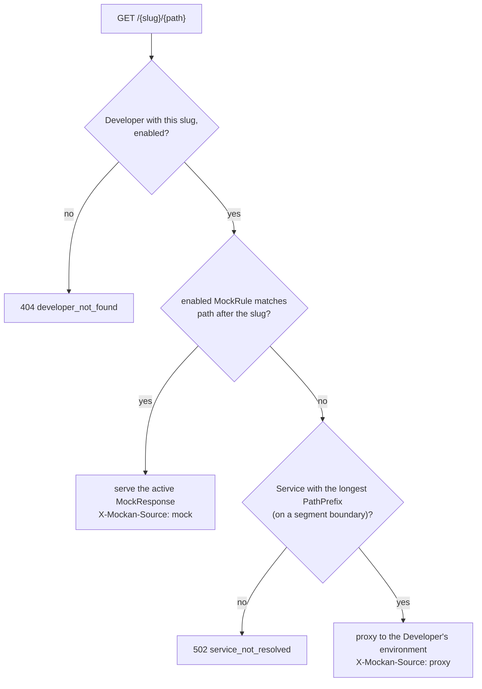

# Mockan Backend — Domain model

> **Summary:** what the glossary words mean in code, how one request is decided, and the semantics settled while building that the architecture left open. The glossary itself is [architecture §2](../Agent/mockan-architecture.md#2-glossary) (normative). Never use the word `tenant` (D-01).

## 1. Entities

| Concept | Code | Notes |
| --- | --- | --- |
| `Developer` | `models.Developer`, `matching.model.DeveloperEntry` | One per SSO subject. `slug` is `null` until claimed and **can be set once**. `is_enabled=false` makes the address `404 developer_not_found` and blocks writes. |
| `Service` | `models.Service`, `ServiceEntry` | Catalog entry (admin-managed): `path_prefix`, `strip_prefix`, `rewrite_origin`, `default_environment`. |
| `ServiceEnvironment` | `models.ServiceEnvironment`, `EnvironmentEntry` | `dev` or `stage`; `base_url`, `timeout_seconds`, `extra_headers`. One per (Service, environment). |
| Environment choice | `models.DeveloperServiceSetting` | No row = the Service's default environment. |
| `MockRule` | `models.MockRule`, `CompiledRule` | Owned by one Developer. Matching fields + `priority` + `is_enabled` + `active_response_id`. |
| `MockResponse` | `models.MockResponse`, `CompiledResponse` | A rule has 1..n; exactly one is active (the "scenario" the Gateway serves). |

## 2. Deciding one request

Rules are matched against the path **after** the slug and **before** the Service is resolved, so `MockRule.service_id` is informational only and never filters matching (G-7, OQ-B1).

## 3. Matching semantics

- **Match types:** `Exact` (case-insensitive, trailing slash ignored), `Template` (`{name}` = one non-empty segment, `{*name}` = rest, last only, case-insensitive literals), `Prefix` (case-insensitive), `Regex` (RE2, original case, search semantics, ≤ 512 characters; OQ-B3).
- **Method:** equals the rule's method or the rule's method is `ANY`; `HEAD` doesn't match a `GET` rule (OQ-B5).
- **Conditions** (all must hold): query `equals` = any value equals, `exists`; header names case-insensitive, values case-sensitive.
- **Winner** among matches: lowest `priority` → type rank (Exact < Template < Prefix < Regex) → longer pattern → older rule (`created_at`).
- **Save-time validation and the Gateway use one compiler** (`mockan.matching.compile_rule`), so a rule the Admin accepts is a rule the Gateway runs.

## 4. Invariants the code keeps

| Invariant | Enforced by |
| --- | --- |
| A rule always has an active response; its last response can't be deleted (G-3). | Admin (`409 last_response`); `active_response_id` is `SET NULL` only by direct SQL. |
| Slug set once, unique, never reserved (`_*`, `api`, `hubs`, `health`). | Admin + unique index. |
| `ServiceEnvironment` host is allowlisted, never production. | Admin on save, Gateway before every request (NFR-06). |
| A Developer only reaches their own data. | Every `/me/*` query filters by `developer_id`; a foreign id is `404`. |
| Every config write is audited in the same transaction, secrets and bodies masked. | `infrastructure/audit.py`, Admin services. |
| Every committed config change reaches the Gateways. | `before_commit` hook sends `pg_notify` per Developer id or `catalog`; bulk statements call `notify.mark`. |
| `bodyMode` is `Static` until Phase 2/3 (G-13). | Admin validation (the DB `CHECK` already allows all three). |
