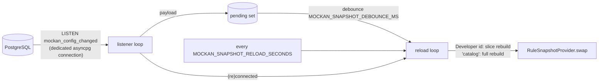

# Mockan Backend — Gateway

> **Summary:** what the data plane does with a request today, in the order it does it, and the decisions that are not obvious from the code. The system-level design is [architecture §6](../Agent/mockan-architecture.md#6-request-lifecycle-gateway); this file records what was built and the gaps settled in the [implementation plan](implementation-plan.md) (G-6, G-7, G-8).

## 1. Pipeline

Pure ASGI middleware (never `BaseHTTPMiddleware`), outermost first. `create_app()` in `gateway/app.py` adds them in reverse because Starlette makes the last-added outermost.

| # | Step | File | What it does |
| --- | --- | --- | --- |
| 1 | Request-log capture | `middleware/request_log_capture.py` | No-op passthrough in Phase 1 (real in B8a, D-18). |
| 2 | CORS | `middleware/cors.py` | Answers preflights with `204`, adds CORS headers to every response (§3). |
| 3 | Error boundary | `middleware/error_boundary.py` | An unexpected exception becomes a `500 internal_error` problem that still passes through CORS. A response already started is not rewritten. |
| 4 | Developer resolution | `middleware/developer_resolution.py` | First path segment → `Developer`; `404 developer_not_found` for unknown, disabled, empty or reserved slugs. Stores a `MockanContext` in `scope["state"]["mockan"]`. |
| 5 | Mock matching | `middleware/mock_matching.py` | `match_request` on the path **after the slug**; a hit answers with the rule's active response. |
| 6 | Proxy route | `app.py` (`_proxy_placeholder`) | Resolves the Service (`502 service_not_resolved` when none). **The forwarder is B4; until then a resolved Service answers `501`.** |

Health routes (`/_mockan/health/live|ready`) are dispatched by FastAPI **before** step 4: steps 2–5 skip those two exact paths. Any other path under `/_mockan/` goes through resolution and gets `404` (reserved slug).

The snapshot is read **once per request** (`context.snapshot_for`, first caller wins) and that object is used for the whole request, so a swap mid-request can't mix two states.

## 2. Responses and `X-Mockan-Source` (PR-09, G-6)

Every response carries the header.

| Response | Value | Notes |
| --- | --- | --- |
| Mocked | `mock` + `X-Mockan-Rule-Id` | |
| Proxied | `proxy` | B4. |
| Mockan problem (any `4xx/5xx` Mockan made) | `error` | `application/problem+json`, `Cache-Control: no-store`. |
| Mockan-answered preflight | `mock` | `TODO(OQ-B2)` |
| Health | `mock` | Same reasoning as the preflight, `TODO(OQ-B2)`. |

### Problem codes (arch §14 rule 8; all from `ErrorCode`)

| Code | Status | When |
| --- | --- | --- |
| `developer_not_found` | 404 | Unknown, disabled, empty or reserved slug. |
| `service_not_resolved` | 502 | No Service prefix matches, or the Service has no usable environment. |
| `upstream_unreachable` / `upstream_timeout` | 502 / 504 | B4. |
| `mock_render_failed` | 500 | B8c. |
| `internal_error` | 500 | Unhandled exception (details are logged, never returned). |

Every problem body has `type`, `title`, `status`, `code`, `detail`, plus `developer` (the slug as sent, `""` when absent) and `path` (PR-16).

## 3. CORS (D-13, PR-03)

- **Preflight** = `OPTIONS` with `Access-Control-Request-Method`. Always `204`, never forwarded, never answered by a rule. Allowed origin → `Allow-Origin` (echo), `Allow-Credentials: true`, `Allow-Methods` (the requested method), `Allow-Headers` (the requested headers), `Max-Age: 600`. A disallowed origin still gets `204`, without those headers (the browser blocks it).
- **Other responses** (mock, proxied, problem): any `Access-Control-*` header from a mock or an upstream is **removed** and Mockan's added: `Allow-Origin` (echo), `Allow-Credentials: true`, `Expose-Headers: X-Mockan-Source, X-Mockan-Rule-Id` — only for an allowed origin. `Vary: Origin` is always merged into any existing `Vary`.
- **Whose origins:** the Developer's `allowedOrigins`; an unknown slug falls back to `MOCKAN_DEFAULT_ALLOWED_ORIGINS`, so error responses stay readable by the browser.
- **Origin matching is not a glob.** `domain.validation.origin_is_allowed` compares scheme, host and port separately: `http://localhost:*` matches `http://localhost:5173` and `http://localhost`, but never `http://localhost:1.evil.com`. A host may be `*.example.com` (subdomains only, never the apex).

## 4. Mock responses (PR-06)

- Delay uses `asyncio.sleep` (never blocks the loop; tested with a concurrent fast request).
- The rule's `contentType` is authoritative. A mock cannot set `Content-Length`, `Transfer-Encoding`, `Connection`, `Keep-Alive`, `Content-Type`, or any hop-by-hop header, and it cannot override `X-Mockan-*`. Headers whose name or value contains CR, LF or NUL are dropped (header injection; the Admin rejects them on save too, B6).
- `1xx`, `204` and `304` send no body.
- The request body is never read for a mocked response.
- **G-7:** `mock_rules.service_id` is informational only and does not filter matching (`TODO(OQ-B1)`), because matching runs before Service resolution.

## 5. Snapshot service (D-07, FR-08, PR-07)

`gateway/snapshot_service.py`, started and stopped in the app's lifespan (skipped when a `snapshot_provider` is injected, which is how tests avoid the database).

- A payload that is a Developer id rebuilds that Developer's slice (`load_developer` + `with_developer_slice`); `catalog` (or a snapshot that never loaded) rebuilds everything. Each reload runs in one `REPEATABLE READ` transaction, so its queries see one consistent state.
- **Missed notifications:** a full reload runs on every (re)connect, and every `MOCKAN_SNAPSHOT_RELOAD_SECONDS` (default 60) as a safety net.
- **Failure handling:** a failed reload keeps the last snapshot, sets `degraded`, and retries with exponential backoff (0.5 s doubling, capped at 30 s). The listener reconnects with the same backoff.
- **`degraded`** = the LISTEN connection is down **or** the last reload failed. It clears when both are healthy again.
- The listener's connection has `application_name = mockan-gateway-listener` (visible in `pg_stat_activity`).
- The shared `httpx.AsyncClient` joins this lifespan in B4.

## 6. Health (G-8, PR-17)

| Route | Response |
| --- | --- |
| `GET /_mockan/health/live` | Always `200 {"status":"live"}`. |
| `GET /_mockan/health/ready` | `503 {"status":"starting"}` until the first snapshot loads. Afterwards `200 {"status":"ready"\|"degraded","snapshotAgeSeconds":n}`. A degraded Gateway stays in rotation because it keeps serving the last good rules. |

## 7. Performance notes

- `match_request` with 500 rules for one Developer (`server/bench/match_bench.py`, 4 match types mixed): p95 ≈ 0.04 ms for a miss and for hits (target < 0.2 ms). A per-rule `literal_prefix` pre-filter rejects most rules with one `startswith` before their matcher runs; without it a miss cost ≈ 0.18 ms, dominated by RE2's per-call overhead. Unanchored regexes get no pre-filter, so a Developer with hundreds of them pays ≈ 1.2 µs per rule.
- Proxy overhead (NFR-01) is measured in B4.

## 8. Open-question markers

| ID | Where | Default |
| --- | --- | --- |
| OQ-B1 | `matching/` (G-7) | `service_id` is informational. |
| OQ-B2 | `middleware/cors.py`, `health.py`, `problems.py` | `X-Mockan-Source`: `error` for problems, `mock` for preflight and health. |
| OQ-B3 | `matching/compile.py` | Regex matches the original-case path. |
| OQ-B5 | `matching/matcher.py` | `HEAD` does not match a `GET` rule. |
