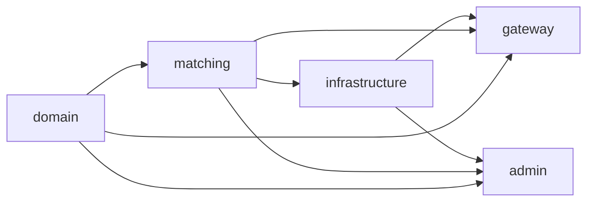

# Mockan Backend — Project structure

> **Summary:** where every kind of backend code goes inside `server/`, which modules may import which, and the commands to run things. Read this before adding a file.

## 1. Layout

```text
server/
├── pyproject.toml                  # deps, [tool.ruff], [tool.mypy], [tool.pytest.ini_options], [tool.importlinter]
├── uv.lock
├── .python-version                 # 3.14
├── alembic.ini
├── migrations/
│   ├── env.py                      # async Alembic env; target_metadata = mockan.infrastructure.db.models.Base.metadata
│   └── versions/                   # one file per migration: YYYYMMDD_HHMM_<slug>.py
├── src/mockan/
│   ├── __init__.py
│   ├── domain/
│   │   ├── enums.py                # MatchType, BodyMode, RequestSource, EnvironmentName, AuditAction
│   │   ├── constants.py            # SLUG_REGEX, RESERVED_SLUGS, limits (MAX_BODY_BYTES, MAX_DELAY_MS, MAX_REGEX_LENGTH)
│   │   ├── errors.py               # ErrorCode (stable problem+json codes, arch §14 rule 8)
│   │   └── validation.py           # is_valid_slug(), is_reserved_slug(), host_is_allowed()
│   ├── matching/
│   │   ├── model.py                # Frozen dataclasses: CompiledRule, CompiledResponse, ServiceEntry, DeveloperEntry, RequestFacts
│   │   ├── compile.py              # compile_pattern / compile_rule / compile_response: exact, template, prefix, regex (RE2)
│   │   ├── template.py             # Mockan template parser/matcher ({name}, {*name})
│   │   ├── paths.py                # trailing-slash normalisation and segment splitting
│   │   ├── errors.py               # PatternError(field, message), ServiceNotResolvedError
│   │   ├── snapshot.py             # RuleSnapshot (immutable), RuleSnapshotProvider
│   │   ├── matcher.py              # match_request() → MatchResult (precedence, arch §7.2)
│   │   └── service_resolver.py     # resolve_service() → longest PathPrefix + environment choice
│   ├── infrastructure/
│   │   ├── settings.py             # MockanSettings (pydantic-settings, prefix MOCKAN_)
│   │   ├── db/
│   │   │   ├── models.py           # SQLAlchemy declarative models (schema "mockan")
│   │   │   ├── session.py          # engine + async_sessionmaker factory
│   │   │   └── notify.py           # before_commit hook → pg_notify('mockan_config_changed', …)
│   │   ├── snapshot_loader.py      # DB rows → mockan.matching snapshot objects (load_full, load_developer)
│   │   ├── audit.py                # record(): masked audit_logs row in the caller's transaction
│   │   ├── masking.py              # header/JSON secret masking (NFR-07)
│   │   └── logging.py              # structlog configuration
│   ├── gateway/
│   │   ├── app.py                  # create_app(): lifespan, middleware order (arch §6.2), routes
│   │   ├── context.py              # MockanContext stored in scope["state"]["mockan"]
│   │   ├── middleware/             # cors.py, error_boundary.py, developer_resolution.py, mock_matching.py, request_log_capture.py
│   │   ├── proxy/                  # forwarder.py (httpx streaming), websocket.py (WS bridge), transform.py (ProxyTransformer)
│   │   ├── snapshot_service.py     # LISTEN + debounce + periodic reload (D-07)
│   │   ├── problems.py             # problem+json responses
│   │   └── health.py               # /_mockan/health/live, /_mockan/health/ready
│   └── admin/
│       ├── app.py                  # create_app(): routers under /api/v1, auth, static Panel
│       ├── auth.py                 # OIDC (Authlib), current_developer, require_admin
│       ├── deps.py                 # DB session dependency, settings dependency
│       ├── schemas/                # Pydantic request/response models (camelCase JSON)
│       ├── routers/                # me.py, services.py, service_settings.py, rules.py, responses.py
│       ├── services/               # use-case functions (validation + persistence + audit)
│       ├── problems.py             # exception → problem+json handlers
│       └── static/                 # built Panel (git-ignored, filled by the Panel build)
└── tests/
    ├── conftest.py
    ├── support/                    # snapshot_builder.py (in-memory RuleSnapshot), fake_upstream.py, live_server.py (real Uvicorn in a thread), rss.py
    ├── domain/
    ├── infrastructure/             # settings, masking, logging (fast); database, notify, loader (db)
    ├── matching/                   # incl. precedence_parity.json, shared with the Panel's vitest
    ├── gateway/
    └── admin/
```

> The code folder is `server/`, not `backend/`, so it can't collide with the `Backend/` docs folder on case-insensitive file systems.

## 2. Module boundaries

Dependencies point **one way only**:



(Arrow = "is imported by".)

| Module | MAY import | MUST NOT import |
| --- | --- | --- |
| `mockan.domain` | stdlib only | any third-party package, any other `mockan.*` |
| `mockan.matching` | stdlib, `re2`, `mockan.domain` | `fastapi`, `starlette`, `sqlalchemy`, `asyncpg`, `httpx`, `mockan.infrastructure`, `mockan.gateway`, `mockan.admin` |
| `mockan.infrastructure` | `mockan.domain`, `mockan.matching`, SQLAlchemy, asyncpg, pydantic-settings, structlog | `fastapi`, `starlette`, `mockan.gateway`, `mockan.admin` |
| `mockan.gateway` | everything above, FastAPI, httpx, websockets | `mockan.admin`; SQLAlchemy sessions on the request path (NFR-02) |
| `mockan.admin` | everything above, FastAPI, Authlib | `mockan.gateway` |

These rules are `[tool.importlinter]` contracts in `server/pyproject.toml`; CI runs `uv run lint-imports`.

**Why the Gateway may import `mockan.infrastructure`:** it needs the settings, the snapshot loader and the request-log writer at startup/background time. It must still never touch the database while serving a request (arch §14 rule 2).

## 3. Where to put new code

| You are adding… | Put it in |
| --- | --- |
| A new enum value, limit or error code | `mockan/domain/` |
| A new match type or condition kind | `mockan/matching/compile.py` + `matcher.py`, tests in `tests/matching/` |
| A new table or column | `mockan/infrastructure/db/models.py` + new Alembic migration + arch §8 table |
| A new Admin endpoint | `admin/schemas/`, `admin/services/`, `admin/routers/` + arch §10 table |
| A new proxy header rule | `gateway/proxy/transform.py` + arch §6.3 table + `tests/gateway/` |
| A new setting | `infrastructure/settings.py` + arch §12.3 table |

## 4. Commands

Run from `server/`:

| Task | Command |
| --- | --- |
| Install / sync deps | `uv sync` |
| Add a dependency | `uv add <pkg>` (dev: `uv add --dev <pkg>`) + update [tech-stack.md](tech-stack.md) |
| Run Gateway (dev) | `uv run uvicorn mockan.gateway.app:create_app --factory --port 8080 --reload` |
| Run Admin (dev) | `uv run uvicorn mockan.admin.app:create_app --factory --port 8081 --reload` |
| New migration | `uv run alembic revision --autogenerate -m "<slug>"` (review the file by hand) |
| Apply migrations | `uv run alembic upgrade head` |
| Tests | `uv run pytest` (only unit: `uv run pytest tests/matching`) |
| Lint / format | `uv run ruff check . && uv run ruff format --check .` |
| Types | `uv run mypy src` |
| Layer rules | `uv run lint-imports` |
