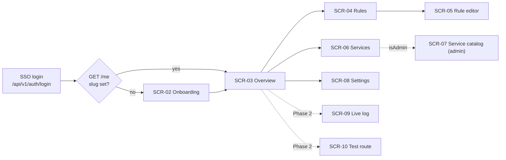

# Mockan Panel — Screens

> **Summary:** every Panel screen (SCR-02 … SCR-10): route, data (Admin API routes from arch §10 only), content, states and acceptance criteria. Moved from the build brief (prompt §5) and kept current with the code. Every screen implements four states: **loading** (skeletons shaped like the content), **empty**, **error** (`ProblemAlert` + retry) and **success**.

## Navigation and access

| Screen | Route | Status |
| --- | --- | --- |
| SCR-02 Onboarding | `/onboarding` | Planned (M1) |
| SCR-03 Overview | `/` | Planned (M2) |
| SCR-04 Rules | `/rules` | Planned (M3) |
| SCR-05 Rule editor | `/rules/new`, `/rules/:ruleId` | Planned (M3) |
| SCR-06 Services | `/services` | Planned (M2) |
| SCR-07 Service catalog (admin) | `/admin/services` | Planned (M4) |
| SCR-08 Settings | `/settings` | Planned (M2) |
| SCR-09 Live log | `/logs` | Phase 2 — not in navigation |
| SCR-10 Test route | `/test-route` | Phase 2 — not in navigation |
| Style guide (dev only) | `/__design` | Built (M0) |

**Sidebar:** Overview · Rules · Services · Settings; Admin group (only when `isAdmin`): Service catalog. Phase 2 screens are added only when they work.

**Auth guard (`src/app/auth-gate.tsx`):**
- [ ] Any `401` → full-page navigation to `/api/v1/auth/login`.
- [ ] `GET /me` with `slug: null` → every route except `/onboarding` redirects there.
- [ ] `isEnabled: false` → full-page explanation, not the app.
- [ ] `/admin/*` for a non-admin → 403 page.

## SCR-02 Onboarding — PR-01, PR-18, US-01

- **Data:** `GET /me`, `PUT /me` (`{ slug }`, once).
- **Content:** serif title "Claim your workspace"; slug input (mono, live-validated); live preview of the resulting base URL; confirm step stating the slug "cannot be changed later"; after success a two-step panel: (1) `BaseUrlCard` with the `.env` line, (2) "Start your app — everything is proxied until you add a mock" with the primary button "Create your first mock".
- **Validation:** `^[a-z][a-z0-9-]{1,31}$`; reserved `_*`, `api`, `hubs`, `health`; server conflict (`409 slug_taken`) shows inline under the field.
- **Accept:**
  - [ ] Invalid slug shows the reason inline before submit; the submit button stays enabled but submit is blocked with focus moved to the field.
  - [ ] The slug is shown as "cannot be changed later" before confirming.
  - [ ] After success, the `.env` line is copyable with one click.

## SCR-03 Overview — PR-18, US-06, US-53, G4

- **Data:** `GET /me`, `GET /me/rules`, `GET /services`, `GET /me/service-settings`.
- **Layout:** greeting (`display-md`) "Good morning, {displayName}" + "{n} mocks active · everything else is proxied to the real backend."; `BaseUrlCard`; stat tiles (Active mocks `{enabled}/{total}`, Services `{count}` with "{k} on dev", Allowed origins `{count}`); Active mocks list (≤ 8 enabled rules with switch) + Getting-started checklist (auto-ticks slug set and ≥ 1 rule; manual ticks in `localStorage`; hidden when all ticked).
- **Empty (no rules):** "No rules yet — all traffic is proxied. Create your first mock." + primary button.
- **Accept:**
  - [ ] A brand-new Developer sees base URL, empty state and checklist above the fold at 1280×800.
  - [ ] Toggling a rule here behaves exactly like on the Rules screen (shared `useToggleRule`).

## SCR-04 Rules — PR-05, PR-08, PR-18, US-03, US-06

- **Data:** `GET /me/rules`, `POST /me/rules/{ruleId}/toggle`, `POST /me/rules/toggle-all`, `DELETE /me/rules/{ruleId}`, `POST /me/rules` (duplicate).
- **Content:** `PageHeader` "Mock rules" + primary "New rule"; toolbar: search (name or pattern), filters (state, method, match type, Service); "Disable all / Enable all".
- **Columns:** Switch · Name · Method · Match type · Pattern (mono, truncated with tooltip) · Service (or "Any") · Active scenario (`StatusCode` + name) · Priority · Updated · row menu (Edit, Duplicate, Delete). Stacked cards below 768 px.
- **Sort:** gateway precedence (arch §7.2), labelled "Sorted by match precedence".
- **Accept:**
  - [ ] Disabled rules stay in the list, dimmed, and can be re-enabled without opening them (PR-08).
  - [ ] Row click opens the editor; the switch and row menu don't trigger navigation.
  - [ ] Empty state uses the PRD copy.
  - [ ] Toggles are optimistic with rollback + toast on error; success toast "Saved — live in about 2 seconds" (PR-07).

## SCR-05 Rule editor — PR-05, PR-06, US-03, US-04, US-12

- **Data:** `GET/PUT/DELETE /me/rules/{ruleId}`, `POST /me/rules`, `POST/PUT /me/rules/{ruleId}/responses[/{responseId}]`, `GET /services`.
- **Layout:** form (7 cols) + sticky live summary (5 cols) at ≥ 1280 px; single column below. Sticky footer with Cancel and **Save**.
- **Match:** name; method (`ANY GET POST PUT PATCH DELETE HEAD OPTIONS`); match type segmented control with help + example (arch §7.1); pattern (mono) with helper "Matches the path **after** your slug, e.g. `/limsa/api/v1/dashboard`."; Service scope (default "Any service"); priority (default 100, "lower wins").
- **Conditions** (collapsible, collapsed when empty): query and header conditions (`equals` / `exists`).
- **Response:** status (combobox with presets 200, 201, 204, 400, 401, 403, 404, 409, 422, 500, 502, 503; 100–599); content type (default `application/json`); headers; body (`JsonEditor` for JSON, mono textarea otherwise); delay slider 0–30 000 ms + number input + presets 0 / 300 ms / 1 s / 3 s. Phase 1 edits the active response only (`TODO(OQ-P1)`).
- **Live summary:** "`GET` requests to `/limsa/api/v1/orders/{id}` return **200** after **300 ms**" + response headers preview incl. `X-Mockan-Source: mock`.
- **Accept:**
  - [ ] Invalid JSON blocks save and shows line/column (PR-06).
  - [ ] Leaving with unsaved changes asks for confirmation.
  - [ ] Server validation errors land on the right field, not only in a toast.
  - [ ] Delete lives in a "Danger zone" at the bottom with `ConfirmDialog`.

## SCR-06 Services — PR-04, US-07

- **Data:** `GET /services`, `GET/PUT /me/service-settings`.
- **Table:** Service name · Path prefix (mono) · Strip prefix (Yes/No) · Environment (select; Service default marked "default") · Upstream base URL for the selected environment (mono, read-only, truncated).
- **Behaviour:** changing the environment saves immediately (optimistic); toast "limsa now proxies to dev — live in about 2 seconds".
- **Accept:**
  - [ ] Non-admins see no edit controls for the catalog (PR-10).
  - [ ] A Service with only one environment shows it as text, not a select.

## SCR-07 Service catalog (admin) — PR-10, PR-15, US-30, US-31

- **Visible only when `isAdmin`.** Non-admins hitting the route see a 403 page.
- **Data:** `POST/PUT/DELETE /services[/{id}]`, `POST/PUT/DELETE /services/{id}/environments[/{envId}]`.
- **Content:** Services table; create/edit in a right `Sheet`: name, path prefix, strip prefix, rewrite origin, default environment; environments (environment, base URL, timeout seconds default 100, extra headers).
- **Accept:**
  - [ ] A base URL whose host is not in the allowlist shows the server's rejection inline on the base URL field: "Only allowlisted dev/stage hosts can be used."
  - [ ] Duplicate name / path prefix errors appear on the field.
  - [ ] Deletes use `ConfirmDialog` naming the Service.

## SCR-08 Settings — PR-03, US-54

- **Data:** `GET/PUT /me`.
- **Content:** display name; workspace slug (read-only, mono) with `BaseUrlCard`; Allowed origins list editor (globs; defaults `http://localhost:*`, `http://127.0.0.1:*`; "Reset to defaults").
- **Accept:**
  - [ ] Saving an empty origins list asks for confirmation ("browser calls will fail CORS").

## Phase 2 (M5, only when asked)

SCR-09 Live log (WebSocket `/hubs/request-log`, source filter, details drawer, **Mock this** → `POST /me/request-logs/{id}/create-rule`, PR-12); SCR-10 Test route (`POST /me/test-route`, PR-13); scenario tabs + activate (PR-11); export/import with merge/replace (PR-14).
