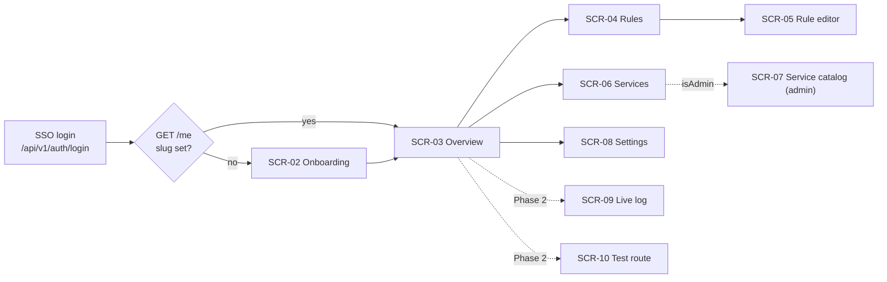

# Mockan Panel — Screens

> **Summary:** every Panel screen (SCR-02 … SCR-10): route, data (Admin API routes from arch §10 only), content, states and acceptance criteria. Moved from the build brief (prompt §5) and kept current with the code. Every screen implements four states: **loading** (skeletons shaped like the content), **empty**, **error** (`ProblemAlert` + retry) and **success**.

## Navigation and access

| Screen | Route | Status |
| --- | --- | --- |
| SCR-02 Onboarding | `/onboarding` | Built (M1) |
| SCR-03 Overview | `/` | Built (M2) |
| SCR-04 Rules | `/rules` | Built (M3) |
| SCR-05 Rule editor | `/rules/new`, `/rules/:ruleId` | Built (M3) |
| SCR-06 Services | `/services` | Built (M2) |
| SCR-07 Service catalog (admin) | `/admin/services` | Built (M4) |
| SCR-08 Settings | `/settings` | Built (M2) |
| SCR-09 Live log | `/logs` | Phase 2 — not in navigation |
| SCR-10 Test route | `/test-route` | Phase 2 — not in navigation |
| Style guide (dev only) | `/__design` | Built (M0) |

**Sidebar:** Overview · Rules · Services · Settings; Admin group (only when `isAdmin`): Service catalog. Phase 2 screens are added only when they work.

**Auth guard (`src/app/auth-gate.tsx`, tests in `auth-gate.test.tsx`):**
- [x] Any `401` → full-page navigation to `/api/v1/auth/login` (in dev, a dev-only route simulates SSO and returns).
- [x] `GET /me` with `slug: null` → every route except `/onboarding` redirects there.
- [x] `isEnabled: false` → full-page explanation, not the app.
- [x] `/admin/*` for a non-admin → 403 page (`AdminGate`).
- [x] `GET /me` failing (not 401) → full-page `ProblemAlert` with retry.

## SCR-02 Onboarding — PR-01, PR-18, US-01

- **Data:** `GET /me`, `PUT /me` (`{ slug }`, once).
- **Content:** serif title "Claim your workspace"; slug input (mono, live-validated); live preview of the resulting base URL; confirm step stating the slug "cannot be changed later"; after success a two-step panel: (1) `BaseUrlCard` with the `.env` line, (2) "Start your app — everything is proxied until you add a mock" with the primary button "Create your first mock".
- **Validation:** `^[a-z][a-z0-9-]{1,31}$`; reserved `_*`, `api`, `hubs`, `health`; server conflict (`409 slug_taken`) shows inline under the field.
- **Behaviour:** the field is pre-filled with a slug suggested from the display name; "Continue" opens a confirm dialog; an already-onboarded Developer is sent to `/`.
- **Accept** (tests: `src/features/onboarding/onboarding.test.tsx`):
  - [x] Invalid slug shows the reason inline before submit; the submit button stays enabled but submit is blocked with focus moved to the field.
  - [x] The slug is shown as "cannot be changed later" before confirming.
  - [x] After success, the `.env` line is copyable with one click.

## SCR-03 Overview — PR-18, US-06, US-53, G4

- **Data:** `GET /me`, `GET /me/rules`, `GET /services`, `GET /me/service-settings`.
- **Layout:** greeting (`display-md`) "Good morning, {displayName}" + "{n} mocks active · everything else is proxied to the real backend."; `BaseUrlCard`; stat tiles (Active mocks `{enabled}/{total}`, Services `{count}` with "{k} on dev", Allowed origins `{count}`); Active mocks list (≤ 8 enabled rules with switch) + Getting-started checklist (auto-ticks slug set and ≥ 1 rule; manual ticks in `localStorage`; hidden when all ticked).
- **Empty (no rules):** "No rules yet — all traffic is proxied. Create your first mock." + primary button.
- **Behaviour:** a rule switched off in the Active mocks list stays visible (dimmed) until you leave the page, so rows don't jump under the pointer.
- **Accept** (tests: `src/features/overview/overview.test.tsx`):
  - [x] A brand-new Developer sees base URL, empty state and checklist above the fold at 1280×800 (checked by screenshot).
  - [x] Toggling a rule here behaves exactly like on the Rules screen (shared `useToggleRule`).

## SCR-04 Rules — PR-05, PR-08, PR-18, US-03, US-06

- **Data:** `GET /me/rules`, `POST /me/rules/{ruleId}/toggle`, `POST /me/rules/toggle-all`, `DELETE /me/rules/{ruleId}`, `POST /me/rules` (duplicate).
- **Content:** `PageHeader` "Mock rules" + primary "New rule"; toolbar: search (name or pattern), filters (state, method, match type, Service); "Disable all / Enable all".
- **Columns:** Switch · Name · Method · Match type · Pattern (mono, truncated with tooltip) · Service (or "Any") · Active scenario (`StatusCode` + name) · Priority · Updated · row menu (Edit, Duplicate, Delete). Stacked cards below 768 px.
- **Sort:** gateway precedence (arch §7.2), labelled "Sorted by match precedence".
- **Behaviour:** filters live in the URL (`?q=&state=&method=&type=&service=`); "Disable all" confirms when more than one rule is enabled; Duplicate creates a disabled copy "<name> (copy)"; the header's "New rule" is hidden in the empty state so the view keeps one primary button.
- **Accept** (tests: `src/features/rules/rules.test.tsx`):
  - [x] Disabled rules stay in the list, dimmed, and can be re-enabled without opening them (PR-08).
  - [x] Row click opens the editor; the switch and row menu don't trigger navigation.
  - [x] Empty state uses the PRD copy.
  - [x] Toggles are optimistic with rollback + toast on error; success toast "Saved — live in about 2 seconds" (PR-07).

## SCR-05 Rule editor — PR-05, PR-06, US-03, US-04, US-12

- **Data:** `GET/PUT/DELETE /me/rules/{ruleId}`, `POST /me/rules`, `POST/PUT /me/rules/{ruleId}/responses[/{responseId}]`, `GET /services`.
- **Layout:** form (7 cols) + sticky live summary (5 cols) at ≥ 1280 px; single column below. Sticky footer with Cancel and **Save**.
- **Match:** name; method (`ANY GET POST PUT PATCH DELETE HEAD OPTIONS`); match type segmented control with help + example (arch §7.1); pattern (mono) with helper "Matches the path **after** your slug, e.g. `/limsa/api/v1/dashboard`."; Service scope (default "Any service"); priority (default 100, "lower wins").
- **Conditions** (collapsible, collapsed when empty): query and header conditions (`equals` / `exists`).
- **Response:** status (combobox with presets 200, 201, 204, 400, 401, 403, 404, 409, 422, 500, 502, 503; 100–599); content type (default `application/json`); headers; body (`JsonEditor` for JSON, mono textarea otherwise); delay slider 0–30 000 ms + number input + presets 0 / 300 ms / 1 s / 3 s. Phase 1 edits the active response only (`TODO(OQ-P1)`).
- **Live summary:** "`GET` requests to `/limsa/api/v1/orders/{id}` return **200** after **300 ms**" + response headers preview incl. `X-Mockan-Source: mock`.
- **Behaviour:** creating a rule returns to `/rules`; saving an existing rule stays on the editor. Server field paths map onto form fields (`responses.0.statusCode` → `response.statusCode`); unmapped errors show a `ProblemAlert` above the form. Unsaved changes also trigger the browser's leave-page prompt.
- **Accept** (tests: `src/features/rules/rule-editor.test.tsx`):
  - [x] Invalid JSON blocks save and shows line/column (PR-06).
  - [x] Leaving with unsaved changes asks for confirmation.
  - [x] Server validation errors land on the right field, not only in a toast.
  - [x] Delete lives in a "Danger zone" at the bottom with `ConfirmDialog`.

## SCR-06 Services — PR-04, US-07

- **Data:** `GET /services`, `GET/PUT /me/service-settings`.
- **Table:** Service name · Path prefix (mono) · Strip prefix (Yes/No) · Environment (select; Service default marked "default") · Upstream base URL for the selected environment (mono, read-only, truncated).
- **Behaviour:** changing the environment saves immediately (optimistic); toast "limsa now proxies to dev — live in about 2 seconds". Choosing the Service default removes the override row (absent = default, arch §8). Admins get a secondary "Manage catalog" link. Stacked cards below 768 px.
- **Accept** (tests: `src/features/services/services.test.tsx`):
  - [x] Non-admins see no edit controls for the catalog (PR-10).
  - [x] A Service with only one environment shows it as text, not a select.

## SCR-07 Service catalog (admin) — PR-10, PR-15, US-30, US-31

- **Visible only when `isAdmin`.** Non-admins hitting the route see a 403 page.
- **Data:** `POST/PUT/DELETE /services[/{id}]`, `POST/PUT/DELETE /services/{id}/environments[/{envId}]`.
- **Content:** Services table; create/edit in a right `Sheet`: name, path prefix, strip prefix, rewrite origin, default environment; environments (environment, base URL, timeout seconds default 100, extra headers).
- **Behaviour:** saving runs `POST/PUT /services[/{id}]`, then deletes removed environments and `POST`/`PUT`s the rest (`useSaveService`). If an environment fails after the Service was created, the sheet keeps the new Service and the next save updates it. Stacked cards below 768 px.
- **Accept** (tests: `src/features/admin/service-catalog.test.tsx`):
  - [x] A base URL whose host is not in the allowlist shows the server's rejection inline on the base URL field: "Only allowlisted dev/stage hosts can be used."
  - [x] Duplicate name / path prefix errors appear on the field.
  - [x] Deletes use `ConfirmDialog` naming the Service.

## SCR-08 Settings — PR-03, US-54

- **Data:** `GET/PUT /me`.
- **Content:** display name; workspace slug (read-only, mono) with `BaseUrlCard`; Allowed origins list editor (globs; defaults `http://localhost:*`, `http://127.0.0.1:*`; "Reset to defaults").
- **Behaviour:** one form; Save is enabled only when something changed; server field errors map onto `displayName` / `allowedOrigins.N`.
- **Accept** (tests: `src/features/settings/settings.test.tsx`):
  - [x] Saving an empty origins list asks for confirmation ("browser calls will fail CORS").

## Screenshots

Supplementary only (C-01: the Markdown above is the source of truth). Captured from the MSW dev backend at 1440 px and 390 px in [`screenshots/`](screenshots/):

| Screen | Desktop | Mobile |
| --- | --- | --- |
| SCR-02 Onboarding | [1440](screenshots/scr-02-onboarding-1440.png) | [390](screenshots/scr-02-onboarding-390.png) |
| SCR-03 Overview | [1440](screenshots/scr-03-overview-1440.png) · [empty](screenshots/scr-03-overview-empty-1440.png) | [390](screenshots/scr-03-overview-390.png) · [empty](screenshots/scr-03-overview-empty-390.png) |
| SCR-04 Rules | [1440](screenshots/scr-04-rules-1440.png) | [390](screenshots/scr-04-rules-390.png) |
| SCR-05 Rule editor | [1440](screenshots/scr-05-rule-editor-1440.png) | [390](screenshots/scr-05-rule-editor-390.png) |
| SCR-06 Services | [1440](screenshots/scr-06-services-1440.png) | [390](screenshots/scr-06-services-390.png) |
| SCR-07 Service catalog | [1440](screenshots/scr-07-service-catalog-1440.png) | [390](screenshots/scr-07-service-catalog-390.png) |
| SCR-08 Settings | [1440](screenshots/scr-08-settings-1440.png) | [390](screenshots/scr-08-settings-390.png) |

## Phase 2 (M5, only when asked)

SCR-09 Live log (WebSocket `/hubs/request-log`, source filter, details drawer, **Mock this** → `POST /me/request-logs/{id}/create-rule`, PR-12); SCR-10 Test route (`POST /me/test-route`, PR-13); scenario tabs + activate (PR-11); export/import with merge/replace (PR-14).
