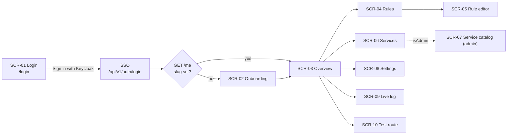

# Mockan Panel — Screens

> **Summary:** every Panel screen (SCR-01 … SCR-10): route, data (Admin API routes from arch §10 only), content, states and acceptance criteria. Moved from the build brief (prompt §5) and kept current with the code. Every screen implements four states: **loading** (skeletons shaped like the content), **empty**, **error** (`ProblemAlert` + retry) and **success**.

## Navigation and access

| Screen | Route | Status |
| --- | --- | --- |
| SCR-01 Login | `/login` | Built |
| SCR-02 Onboarding | `/onboarding` | Built (M1) |
| SCR-03 Overview | `/` | Built (M2) |
| SCR-04 Rules | `/rules` | Built (M3) |
| SCR-05 Rule editor | `/rules/new`, `/rules/:ruleId` | Built (M3) |
| SCR-06 Services | `/services` | Built (M2) |
| SCR-07 Service catalog (admin) | `/admin/services` | Built (M4) |
| SCR-08 Settings | `/settings` | Built (M2) |
| SCR-09 Live log | `/logs` | Built (M5) |
| SCR-10 Test route | `/test-route` | Built (M5) |
| Style guide (dev only) | `/__design` | Built (M0) |

**Sidebar:** Overview · Rules · Live log · Test route · Services · Settings; Admin group (only when `isAdmin`): Service catalog.

**Auth guard (`src/app/auth-gate.tsx`, tests in `auth-gate.test.tsx`):**
- [x] Any `401` → full-page navigation to the login page `/login` (SCR-01), never straight to the identity provider. On the login page itself a `401` does nothing (no redirect loop).
- [x] `GET /me` with `slug: null` → every route except `/onboarding` redirects there.
- [x] `isEnabled: false` → full-page explanation, not the app.
- [x] `/admin/*` for a non-admin → 403 page (`AdminGate`).
- [x] `GET /me` failing (not 401) → full-page `ProblemAlert` with retry.

## SCR-01 Login — PR-15, PR-18, D-12, OQ-04

- **Route:** `/login`, outside the auth guard. Reached by every `401` and by **Sign out**.
- **Data:** `GET /me` only, to bounce an already signed-in Developer to `/`. The button is a plain link to `GET /api/v1/auth/login`, which redirects to the identity provider (Keycloak; authorization code + PKCE).
- **Content:** the logo (`LogoMark` above `Wordmark`), then one card: display title "Sign in to Mockan", one sentence of context, one coral primary button **Sign in with Keycloak** with a key icon (`KeyRoundIcon`), and a caption: "Single sign-on. You'll go to Keycloak and come back here; Mockan never sees your password." There is no password field: Mockan has no passwords of its own. The provider's name is one constant (`SSO_PROVIDER` in `login-page.tsx`).
- **Behaviour:** after the click the button reads "Redirecting to Keycloak…" with a spinner and ignores a second click (`aria-disabled`); if the browser restores the page from its back/forward cache (`pageshow` persisted) the button resets. Sign out lands here instead of re-entering SSO, because Mockan's logout does not end the Keycloak session and an automatic redirect would sign the user straight back in. In the dev-mode Admin (`MOCKAN_AUTH_MODE=dev`) the same button signs in as `dev:dev`; on the MSW dev backend it goes to the simulated SSO route.
- **Not built:** returning to the page the user came from (the Admin always redirects to `/` after login) and a readable error when the Keycloak callback fails (the Admin answers with problem+json).
- **Accept** (tests: `src/features/login/login.test.tsx`; the e2e journey starts here):
  - [x] The page offers "Sign in with Keycloak" as a link to `/api/v1/auth/login` with a key icon, has no password field and no axe violations.
  - [x] After the click the button shows "Redirecting to Keycloak…" and a second click is ignored; a page restored from the cache gets its button back.
  - [x] An already signed-in Developer is sent to `/`.
  - [x] A `401` on `/login` does not redirect again; Sign out ends on `/login`, not on the identity provider.

## SCR-02 Onboarding — PR-01, PR-18, US-01

- **Data:** `GET /me`, `PUT /me` (`{ slug }`, once).
- **Content:** display title "Claim your workspace"; slug input (mono, live-validated); live preview of the resulting base URL; confirm step stating the slug "cannot be changed later"; after success a two-step panel: (1) `BaseUrlCard` with the `.env` line, (2) "Start your app — everything is proxied until you add a mock" with the primary button "Create your first mock".
- **Validation:** `^[a-z][a-z0-9-]{1,31}$`; reserved `_*`, `api`, `hubs`, `health`; server conflict (`409 slug_taken`) shows inline under the field.
- **Behaviour:** the field is pre-filled with a slug suggested from the display name; "Continue" opens a confirm dialog; an already-onboarded Developer is sent to `/`.
- **Accept** (tests: `src/features/onboarding/onboarding.test.tsx`):
  - [x] Invalid slug shows the reason inline before submit; the submit button stays enabled but submit is blocked with focus moved to the field.
  - [x] The slug is shown as "cannot be changed later" before confirming.
  - [x] After success, the `.env` line is copyable with one click.

## SCR-03 Overview — PR-18, US-06, US-53, G4

- **Data:** `GET /me`, `GET /me/rules`, `GET /services`, `GET /me/service-settings`.
- **Layout:** greeting (`display-md`) "Good morning, {displayName}" + "{n} mocks active · everything else is proxied to the real backend."; `BaseUrlCard`; stat tiles (Active mocks `{enabled}/{total}`, Services `{count}` with "{k} on dev", Allowed origins `{count}`); Active mocks list (≤ 8 enabled rules with switch) + Getting-started checklist (auto-ticks slug set and ≥ 1 rule; manual ticks in `localStorage`; hidden when all ticked).
- **Empty (no rules):** "No rules yet — all traffic is proxied. Create your first mock." + primary button.
- **Behaviour:** a rule switched off in the Active mocks list stays visible (dimmed) until you leave the page, so rows don't jump under the pointer.
- **Accept** (tests: `src/features/overview/overview.test.tsx`):
  - [x] A brand-new Developer sees base URL, empty state and checklist above the fold at 1280×800 (checked by screenshot).
  - [x] Toggling a rule here behaves exactly like on the Rules screen (shared `useToggleRule`).

## SCR-04 Rules — PR-05, PR-08, PR-18, US-03, US-06

- **Data:** `GET /me/rules`, `POST /me/rules/{ruleId}/toggle`, `POST /me/rules/toggle-all`, `DELETE /me/rules/{ruleId}`, `POST /me/rules` (duplicate), `GET /me/rules/export`, `POST /me/rules/import?mode=` (PR-14).
- **Content:** `PageHeader` "Mock rules" + primary "New rule"; toolbar: search (name or pattern), filters (state, method, match type, Service); "Disable all / Enable all".
- **Columns:** Switch · Name · Method · Match type · Pattern (mono, truncated with tooltip) · Service (or "Any") · Active scenario (`StatusCode` + name) · Priority · Updated · row menu (Edit, Duplicate, Delete). Stacked cards below 768 px.
- **Export / Import (PR-14, FR-12):** header buttons "Export" (downloads `mockan-rules-<slug>-<date>.json`, with a toast that headers and bodies are exported as stored, so secrets may be in it) and "Import" (also in the empty state). The Import dialog takes a `.json` file, checks it in the browser (JSON, `version: 1`, a non-empty `rules` list, at most 200), shows "N rules, M scenarios", and asks **Add to my rules** (merge, the default; importing a file twice duplicates) or **Replace my rules** (names how many current rules it deletes; destructive button). The server validates the whole file first and writes all or nothing: every problem comes back as `rules.<i>.<field>` / `rules.<i>.responses.<j>.<field>` and is listed as `Rule 2 “Name” → scenario 1 → body: …` (first 10, then "and N more"); nothing was imported.
- **Sort:** gateway precedence (arch §7.2), labelled "Sorted by match precedence".
- **Behaviour:** filters live in the URL (`?q=&state=&method=&type=&service=`); "Disable all" confirms when more than one rule is enabled; Duplicate creates a disabled copy "<name> (copy)"; the header's "New rule" is hidden in the empty state so the view keeps one primary button.
- **Accept** (tests: `src/features/rules/rules.test.tsx`):
  - [x] Disabled rules stay in the list, dimmed, and can be re-enabled without opening them (PR-08).
  - [x] Row click opens the editor; the switch and row menu don't trigger navigation.
  - [x] Empty state uses the PRD copy.
  - [x] Toggles are optimistic with rollback + toast on error; success toast "Saved — live in about 2 seconds" (PR-07).
  - [x] Export downloads a rules file without ids; import merge/replace works; a bad file lists every problem and changes nothing (`src/features/rules/transfer.test.tsx`).

## SCR-05 Rule editor — PR-05, PR-06, US-03, US-04, US-12

- **Data:** `GET/PUT/DELETE /me/rules/{ruleId}`, `POST /me/rules`, `POST/PUT/DELETE /me/rules/{ruleId}/responses[/{responseId}]`, `POST /me/rules/{ruleId}/responses/{responseId}/activate`, `GET /services`.
- **Layout:** form (7 cols) + sticky live summary (5 cols) at ≥ 1280 px; single column below. Sticky footer with Cancel and **Save**.
- **Match:** name; method (`ANY GET POST PUT PATCH DELETE HEAD OPTIONS`); match type segmented control with help + example (arch §7.1); pattern (mono) with helper "Matches the path **after** your slug, e.g. `/limsa/api/v1/dashboard`."; Service scope (default "Any service"); priority (default 100, "lower wins").
- **Conditions** (collapsible, collapsed when empty): query and header conditions (`equals` / `exists`).
- **Response:** status (combobox with presets 200, 201, 204, 400, 401, 403, 404, 409, 422, 500, 502, 503; 100–599); content type (default `application/json`); headers; body (`JsonEditor` for JSON, mono textarea otherwise); delay slider 0–30 000 ms + number input + presets 0 / 300 ms / 1 s / 3 s. Also **body mode** `Static` | `Template` (PR-19): a Template body is not JSON until rendered, so it gets the plain textarea and no JSON check (the server checks its syntax on save).
- **Scenarios (PR-11, OQ-P1):** an existing rule shows one tab per MockResponse (name, status, an **Active** badge on the one the Gateway serves; see [CONTEXT.md](../CONTEXT.md)). The selected tab is the one the form edits and **Save** writes (`PUT …/responses/{id}`). **Make active** (`POST …/activate`) is a separate, immediate action. **Duplicate scenario** (`POST …/responses`) creates a copy of the selected saved scenario named `<name>-copy` and shows it (a scenario is a variant of the same response, so copy-and-tweak is the intended way to make an error or empty variant). **Delete scenario** confirms, and is disabled for the last one (`409 last_response`); deleting the active one makes another active. Switching tab, or duplicating, with unsaved scenario edits asks "Discard unsaved scenario edits?". The summary says "This scenario isn't active" when the selected one is not the active one, and "This rule is disabled: it is skipped…" when `isEnabled` is false (a disabled rule still has an active scenario; it is just never served). A new rule has no tabs (its first scenario becomes live). Body mode is always sent: leaving it out of a `PUT` would reset a Template to Static.
- **Live summary:** "`GET` requests to `/limsa/api/v1/orders/{id}` return **200** after **300 ms**" + response headers preview incl. `X-Mockan-Source: mock`.
- **Behaviour:** creating a rule returns to `/rules`; saving an existing rule stays on the editor. Server field paths map onto form fields (`responses.0.statusCode` → `response.statusCode`); unmapped errors show a `ProblemAlert` above the form. Unsaved changes also trigger the browser's leave-page prompt.
- **Accept** (tests: `src/features/rules/rule-editor.test.tsx`):
  - [x] Invalid JSON blocks save and shows line/column (PR-06).
  - [x] Leaving with unsaved changes asks for confirmation.
  - [x] Server validation errors land on the right field, not only in a toast.
  - [x] Delete lives in a "Danger zone" at the bottom with `ConfirmDialog`.
  - [x] Scenario tabs, Make active, Duplicate/Delete scenario, the disabled-rule note and the unsaved-edit guard; a saved Template body stays a Template (`src/features/rules/scenarios.test.tsx`).

## SCR-06 Services — PR-04, US-07

- **Data:** `GET /services`, `GET/PUT /me/service-settings`.
- **Table:** Service name · Path prefix (mono) · Strip prefix (Yes/No) · Environment (select; Service default marked "default") · Upstream base URL for the selected environment (mono, read-only, truncated).
- **Behaviour:** changing the environment saves immediately (optimistic); toast "limsa now proxies to dev — live in about 2 seconds". Choosing the Service default removes the override row (absent = default, arch §8). Admins get a secondary "Manage catalog" link. Stacked cards below 768 px.
- **Accept** (tests: `src/features/services/services.test.tsx`):
  - [x] Non-admins see no edit controls for the catalog (PR-10).
  - [x] A Service with only one environment shows it as text, not a select.

## SCR-07 Service catalog (admin) — PR-10, PR-15, US-30, US-31

- **Visible only when `isAdmin`.** Non-admins hitting the route see a 403 page.
- **Data:** `POST/PUT/DELETE /services[/{id}]`, `POST/PUT/DELETE /services/{id}/environments[/{envId}]`.
- **Content:** Services table; create/edit in a right `Sheet`: name, path prefix, strip prefix, rewrite origin, default environment; environments (environment, base URL, timeout seconds default 100, extra headers).
- **Behaviour:** saving runs `POST/PUT /services[/{id}]`, then deletes removed environments and `POST`/`PUT`s the rest (`useSaveService`). If an environment fails after the Service was created, the sheet keeps the new Service and the next save updates it. Stacked cards below 768 px.
- **Accept** (tests: `src/features/admin/service-catalog.test.tsx`):
  - [x] A base URL whose host is not in the allowlist shows the server's rejection inline on the base URL field: "Only allowlisted dev/stage hosts can be used."
  - [x] Duplicate name / path prefix errors appear on the field.
  - [x] The path prefix `/` is accepted (a catch-all Service; the form's default) and any longer prefix still wins over it.
  - [x] Deletes use `ConfirmDialog` naming the Service.

## SCR-08 Settings — PR-03, US-54

- **Data:** `GET/PUT /me`.
- **Content:** display name; workspace slug (read-only, mono) with `BaseUrlCard`; Allowed origins list editor (globs; defaults `http://localhost:*`, `http://127.0.0.1:*`; "Reset to defaults").
- **Behaviour:** one form; Save is enabled only when something changed; server field errors map onto `displayName` / `allowedOrigins.N`.
- **Accept** (tests: `src/features/settings/settings.test.tsx`):
  - [x] Saving an empty origins list asks for confirmation ("browser calls will fail CORS").

## Screenshots

Supplementary only (C-01: the Markdown above is the source of truth). Captured from the MSW dev backend at 1440 px and 390 px in [`screenshots/`](screenshots/):

| Screen | Desktop | Mobile |
| --- | --- | --- |
| SCR-01 Login | [1440](screenshots/scr-01-login-1440.png) | [390](screenshots/scr-01-login-390.png) |
| SCR-02 Onboarding | [1440](screenshots/scr-02-onboarding-1440.png) | [390](screenshots/scr-02-onboarding-390.png) |
| SCR-03 Overview | [1440](screenshots/scr-03-overview-1440.png) · [empty](screenshots/scr-03-overview-empty-1440.png) | [390](screenshots/scr-03-overview-390.png) · [empty](screenshots/scr-03-overview-empty-390.png) |
| SCR-04 Rules | [1440](screenshots/scr-04-rules-1440.png) | [390](screenshots/scr-04-rules-390.png) |
| SCR-05 Rule editor | [1440](screenshots/scr-05-rule-editor-1440.png) | [390](screenshots/scr-05-rule-editor-390.png) |
| SCR-06 Services | [1440](screenshots/scr-06-services-1440.png) | [390](screenshots/scr-06-services-390.png) |
| SCR-07 Service catalog | [1440](screenshots/scr-07-service-catalog-1440.png) | [390](screenshots/scr-07-service-catalog-390.png) |
| SCR-08 Settings | [1440](screenshots/scr-08-settings-1440.png) | [390](screenshots/scr-08-settings-390.png) |

## SCR-09 Live log — PR-12, FR-09, US-20

- **Data:** `GET /me/request-logs?cursor=&source=&path=&limit=` (history, newest first, keyset paging), WebSocket `/hubs/request-log` (one `RequestLogEntry` JSON per message, only entries logged after connecting), `POST /me/request-logs/{id}/create-rule` (Mock this), `GET /services` (names in the drawer).
- **Content:** display title "Live log"; a status pill (**Connecting…** / **Live** / **Reconnecting…** / **Paused**) and a Pause / Resume button; filters in the URL (`?source=Proxied|Mocked|Error&path=`; the path filter is debounced 300 ms and is "contains", case-insensitive); table Time · Method · Path (with `?query`) · Source · Status · Duration, stacked cards below 768 px; "Load older requests" (cursor) when more history exists.
- **Live behaviour:** one list from two sources merged by log id (ids are unique and increasing). A live entry that the filters exclude is not shown. **Pause** holds new entries back so rows don't move while you read; the button then reads "Resume (N new)". The socket is at the Admin **root** (`/hubs/request-log`, `ws:`/`wss:` from the page's protocol), not under `VITE_PANEL_BASE_PATH` (OQ-03), and reconnects with backoff (1 s, 2 s, 5 s, then 10 s). At most 500 live entries are kept in memory.
- **Details drawer** (row click or the path button): `METHOD path?query`, source, status, duration, time; Service name and a link to the matched rule; request and response headers and bodies as received. They are already masked by the server (NFR-07: `***`); the Panel never unmasks, logs or stores them. JSON bodies are pretty-printed.
- **Mock this (FR-09):** for **Proxied** and **Error** entries the drawer's one primary button creates an Exact rule for the logged method and path that returns the logged response, then opens it in the editor (an Error entry freezes a failure, which is how a QA reproduces it). For a **Mocked** entry the button is "Open the rule" instead: a rule already answers that request, and a second one would only compete with it by precedence. Refusals (a body cut at 16 KB, a path that can't be an Exact pattern) show the server's field message in a toast and the drawer stays open.
- **States:** skeleton rows; empty "No requests yet" with the base URL to send one to, or "No requests match" with Clear filters; error `ProblemAlert` + retry (history); the feed keeps working if only a refetch fails.
- **Accept** (tests: `src/features/logs/logs.test.tsx`, e2e `e2e/phase2.spec.ts`):
  - [x] History is newest first; a live entry appears at the top without a reload (a faked `WebSocket`, `src/test/fake-socket.ts`).
  - [x] Source and path filters go through the API and the URL; live entries respect them.
  - [x] Pause holds entries until Resume; a dropped connection reconnects.
  - [x] The drawer shows masked values as received; Mock this creates the rule and navigates (Proxied and Error entries only; Mocked entries link to their rule); refusals are explained.

## SCR-10 Test route — PR-13, FR-10, US-21

- **Data:** `POST /me/test-route` `{method?, path, headers?, query?}` → `{outcome: mock|proxy|error, reason, rule?, service?, upstreamUrl?, errorCode?}`. The server runs the Gateway's own decision code and sends nothing upstream.
- **Content:** form (method without `ANY`, path in mono, query parameters, headers; a `?a=b` typed into the path is moved into the query parameters; a repeated name is a repeated parameter) and a result card: **Mocked** (rule link, method, pattern, match type and priority, active scenario with status and delay), **Proxied** (Service, environment, upstream URL), **Error** (the Gateway's `errorCode` in mono with a hint for `service_not_resolved`, `upstream_unreachable`, `developer_not_found`).
- **Validation:** the path must start with `/` (checked before calling); a `path` field error from the server lands under the field; any other failure shows a `ProblemAlert`.
- **Accept** (tests: `src/features/test-route/test-route.test.tsx`):
  - [x] A mock outcome names the rule and its active scenario; a proxy outcome shows the upstream URL (honouring the selected environment and prefix stripping); an error outcome shows its code.
  - [x] A path without a leading `/` never reaches the API.

Phase 2 screenshots are not captured yet (the set above predates M5). Capture them from `npm run dev` at 1440 px and 390 px when needed.
