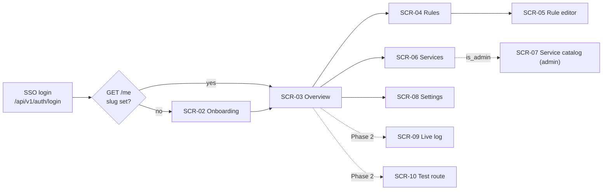

# Agent prompt — Design and implement the Mockan Panel (dashboard)

> **What this file is:** a ready-to-use prompt for an AI coding agent. Paste everything under [§ The prompt](#the-prompt) into the agent, or tell it: *"Follow `docs/agent/prompts/panel-dashboard.md`."* It combines the product scope (PRD), the system contract (architecture) and the visual language (shadcn DESIGN.md) into one brief, and settles the gaps between them so the agent doesn't have to guess.
>
> **Who it's for:** the agent building the Panel, and the engineer reviewing its output.
>
> **Superseded since this was written:** the Panel's headings, titles and wordmark are now **Inter SemiBold (600)**, not a serif, and there is a login screen (SCR-01) and a `LogoMark`. Where this brief says "serif" or "Cormorant Garamond", read [`docs/frontend/design-tokens.md`](../../frontend/design-tokens.md), [`docs/frontend/screens.md`](../../frontend/screens.md) and [`docs/frontend/components.md`](../../frontend/components.md), which track the code.

---

## The prompt

### 0. Role and mission

You are a senior frontend engineer and product designer. Your job is to **design and build the Mockan Panel**: the React + TypeScript single-page app where a frontend developer claims a workspace, picks a backend environment per service, and creates the mock rules their personal gateway serves (D-11, architecture §11, PRD PR-18).

The Panel must look and feel like the design system in `docs/product/design/shadcn-design.md` (warm cream canvas, coral CTAs, serif display headings, dark code surfaces), adapted from a marketing site to a **dense, calm, data-heavy developer tool**, and built on **shadcn/ui**.

Success means a pilot developer can do the core journey (PRD §6) in the Panel in **≤ 5 minutes from first login to first mock** (PRD G4), without reading any docs.

### 1. Read these first (sources of truth)

Read them in full before you write code. If this prompt and a source disagree, the source wins, except for the explicit adaptations in §4 of this prompt, which win over the design file.

| File | What you take from it |
| --- | --- |
| `docs/product/mockan-prd.md` | Scope and priorities (PR-xx, US-xx), acceptance criteria, empty-state copy, phases. |
| `docs/agent/mockan-architecture.md` | Glossary (§2, normative), data model (§8), Admin API routes (§10), Panel screens (§11), validation rules (§10), rules for agents (§14), open questions (§13). |
| `docs/product/design/shadcn-design.md` | Colour, type, radius, spacing tokens and component recipes. Treat its YAML front matter as the token source. |
| `docs/backend/README.md` | How the backend docs are organised; mirror this for `docs/frontend/`. |

### 2. Hard rules (MUST / MUST NOT)

1. **Glossary names are exact** in code, UI copy, types and file names: `Developer`, `DeveloperSlug`, `Service`, `ServiceEnvironment`, `MockRule`, `MockResponse` (UI label: *Scenario*), `Upstream`. MUST NOT use `tenant`, `project`, `endpoint mock`, etc.
2. **Do not invent backend endpoints.** Use only the routes in architecture §10 under base path `/api/v1`. If a screen needs data that no route provides, use the stated default in §9 below or add an open question; do not fake it in the UI.
3. **JSON is camelCase** on the wire (architecture §10). TypeScript types use the same names.
4. **Never show a secret.** Request-log headers/bodies arrive already masked; never "unmask" or log them to the console.
5. **No Anthropic or Claude branding.** The design file describes Claude's visual language. Use its tokens and component recipes, but MUST NOT use the Anthropic spike mark, the words "Claude"/"Anthropic", Copernicus/StyreneB font files, or any Anthropic asset. The product is **Mockan** with its own simple wordmark.
6. **Tokens only.** No raw hex values in components. Every colour, radius and font comes from CSS variables defined once in `panel/src/styles/globals.css` (see §4.2).
7. **Phase discipline.** Build Phase 1 (P0) completely before any Phase 2 (P1) work (see §7). Phase 2 screens MUST NOT appear in navigation until they work.
8. **Open questions:** implement the stated default and leave a `// TODO(OQ-xx)` comment at the exact spot (architecture §0).
9. **Docs change with code (C-01).** Every milestone updates the matching Markdown docs in `docs/frontend/` in the same change (see §10).
10. If something you need contradicts a `D-xx` decision, stop and propose a change instead of deviating (architecture §14 rule 9).

### 3. Tech stack

| Concern | Choice | Notes |
| --- | --- | --- |
| Build | Vite + React 19 + TypeScript (strict) | D-11. Code lives in `panel/`. Build output is copied to `server/src/mockan/admin/static/`. |
| UI kit | **shadcn/ui** (Radix primitives) + **Tailwind CSS v4** | Install components with the shadcn CLI into `src/components/ui/`. Re-theme through tokens, not by rewriting components. |
| Icons | `lucide-react` | 16 px in dense UI, 20 px in headers. Stroke 1.75. |
| Routing | React Router (data router) | Vite `base` from `VITE_PANEL_BASE_PATH`, default `/`. `// TODO(OQ-03)` |
| Server state | TanStack Query | One query key factory per resource. Optimistic updates for toggles. |
| Forms | react-hook-form + zod | zod schemas mirror architecture §10 validation rules. |
| Code editor | Monaco (`@monaco-editor/react`) | Architecture §11. Custom dark theme from `surface-dark` tokens. Lazy-loaded. |
| Toasts | `sonner` (shadcn) | |
| API mocking in dev/tests | MSW | The Admin API doesn't exist yet. Handlers + fixtures in `src/mocks/` follow §10 exactly. |
| Fonts | Self-hosted via `@fontsource*` | The Panel runs on the internal network (NFR-05); do not depend on Google Fonts. |
| Tests | Vitest + Testing Library + `vitest-axe`; Playwright for e2e | See §8. |

### 4. Design system — adapting the DESIGN.md to a product dashboard

#### 4.1 What stays and what changes

The design file describes a **marketing site**. A Panel is a tool people use for hours, so apply it like this:

| Design file says | Panel does | Why |
| --- | --- | --- |
| Cream canvas `#faf9f5`, never pure white | Same. Canvas is the page floor; no `#fff` surfaces anywhere. | Brand identity. |
| Coral `primary` used sparingly | One coral **primary button per view** at most (Save, Create mock, Claim slug). Active nav item and focus ring may use coral. Nothing else is coral. | Coral = "the action". |
| Serif display (Copernicus) 400, negative tracking | Serif only for **page titles** (`display-sm` 28 px) and the Overview greeting (`display-md` 36 px). Never in tables, forms, buttons or badges. | Editorial voice without hurting density. |
| `display-xl` 64 px hero, 96 px section rhythm | Not used. Page padding 24–32 px; gap between sections 32 px (`spacing.xl`). | Dashboards need density. |
| Dark navy product surfaces (`surface-dark`) | Used for **code and machine output only**: base URL / `.env` snippet card, JSON body editor, response previews, headers preview. | "Show the product chrome" — here, the actual URLs and JSON. |
| Cream feature cards (`surface-card`) | Stat tiles, empty states, the getting-started checklist, and the active nav item / active tab background. | Second surface tone. |
| Hairline borders, shadow rare | Data cards and tables: canvas background + 1 px `hairline` border, no shadow. Popovers, dropdowns, dialogs: `0 1px 3px rgba(20,20,19,0.08)` plus a hairline. | Colour-block first, shadow rare. |
| "Never document hover; nothing changes on hover" | **Deviation:** interactive table rows and nav items get a `surface-soft` background on hover; buttons only darken on press as specified. | Pointer feedback is needed in a data-heavy tool. Keep it this subtle. |
| Display headings use no bold | Same. Emphasis = size, not weight. Sans labels use 500, never 600+. | |

#### 4.2 shadcn token mapping (light theme)

Define these in `panel/src/styles/globals.css` and expose them to Tailwind with `@theme inline`. The values come from the `colors:` block of the design file.

```css
:root {
  /* shadcn semantic tokens */
  --background: #faf9f5;            /* canvas */
  --foreground: #141413;            /* ink */
  --card: #faf9f5;                  /* canvas + hairline border */
  --card-foreground: #141413;
  --popover: #faf9f5;
  --popover-foreground: #141413;
  --primary: #cc785c;               /* coral */
  --primary-foreground: #ffffff;    /* on-primary */
  --secondary: #efe9de;             /* surface-card */
  --secondary-foreground: #141413;
  --muted: #efe9de;                 /* surface-card */
  --muted-foreground: #6c6a64;      /* muted — see contrast rule 4.4 */
  --accent: #efe9de;                /* active tab / active nav */
  --accent-foreground: #141413;
  --destructive: #c64545;           /* error */
  --border: #e6dfd8;                /* hairline */
  --input: #e6dfd8;
  --ring: #cc785c;                  /* focus: coral, 3px ring at 15–30% alpha */
  --radius: 0.5rem;                 /* 8px = rounded.md */

  --sidebar: #f5f0e8;               /* surface-soft */
  --sidebar-foreground: #3d3d3a;    /* body */
  --sidebar-primary: #cc785c;
  --sidebar-primary-foreground: #ffffff;
  --sidebar-accent: #efe9de;
  --sidebar-accent-foreground: #141413;
  --sidebar-border: #e6dfd8;
  --sidebar-ring: #cc785c;

  --chart-1: #cc785c; --chart-2: #5db8a6; --chart-3: #e8a55a;
  --chart-4: #5db872; --chart-5: #8e8b82;

  /* Mockan extensions (from the design file, same names) */
  --primary-active: #a9583e;
  --primary-disabled: #e6dfd8;
  --body: #3d3d3a;  --body-strong: #252523;  --muted-soft: #8e8b82;
  --hairline-soft: #ebe6df;
  --surface-soft: #f5f0e8;  --surface-card: #efe9de;  --surface-cream-strong: #e8e0d2;
  --surface-dark: #181715;  --surface-dark-elevated: #252320;  --surface-dark-soft: #1f1e1b;
  --on-dark: #faf9f5;  --on-dark-soft: #a09d96;
  --accent-teal: #5db8a6;  --accent-amber: #e8a55a;
  --success: #5db872;  --warning: #d4a017;  --error: #c64545;
}
```

Radii: after installing components, check the computed values: buttons, inputs, selects, tabs = **8 px**; cards, tables, dialogs, sheets = **12 px**; the Overview base-URL card = **16 px**; badges = **pill**. Fix the component class (e.g. `rounded-xl` → `rounded-lg`) if a shadcn default doesn't match. Don't change `--radius` to compensate.

Dark mode: **light theme only in v1.** Keep every colour behind a token so a `.dark` block can be added later. `// TODO(OQ-F2)`

#### 4.3 Typography

| Role | Token | Font stack | Use in Panel |
| --- | --- | --- | --- |
| Page title | `display-sm` 28/1.2, −0.3px, 400 | `"Cormorant Garamond", "EB Garamond", Georgia, serif` (weight 500, −0.02em per the design file's substitute note) | One `<h1>` per page. |
| Greeting | `display-md` 36/1.15, −0.5px | same | Overview only. |
| Section / card title | `title-md` 18/1.4, 500 | `Inter, system-ui, sans-serif` | Card headers, dialog titles. |
| Body | `body-sm` 14/1.55, 400 | Inter | Default UI text (dense tool: 14 px, not 16). |
| Label, badge | `caption` 13/1.4, 500 | Inter | Form labels, badges, table headers. |
| Overline | `caption-uppercase` 12, 500, +1.5px | Inter | Sidebar group labels, "PHASE 2" tags. |
| Code | `code` 14/1.6 (13 px in tables) | `"JetBrains Mono", ui-monospace, monospace` | Patterns, paths, URLs, slugs, status codes, header names, JSON. |

Paths, patterns, URLs and slugs are **always monospace**, everywhere.

#### 4.4 Accessibility and contrast (measured against WCAG 2.2 AA)

| Pair | Ratio | Rule |
| --- | --- | --- |
| `primary` `#cc785c` as text on canvas | 3.11 | **Fail.** Coral text (links, inline emphasis) MUST use `primary-active` `#a9583e` (4.80). |
| White on `primary` button | 3.28 | Below 4.5 for 14 px labels. Default: keep the brand coral fill (design file). `// TODO(OQ-F3)` if accessibility review rejects it, switch the fill to `primary-active` (5.06). |
| `muted` `#6c6a64` on canvas / surface-soft | 5.13 / 4.77 | OK for secondary text. |
| `muted` on `surface-card` | 4.48 | **Fail.** On `surface-card` use `body` `#3d3d3a` (9.02) for secondary text. |
| `muted-soft` `#8e8b82` on canvas | 3.23 | Only for placeholder text and decorative captions, never for information. |
| `accent-teal`, `accent-amber` as text | 2.25 / 2.0 | **Never as text.** Use them as dots, fills or left borders, with `ink` text on top (7.8 / 8.7). |
| `error` `#c64545` text on canvas | 4.59 | OK. |

Also: every interactive element is keyboard-reachable with a visible coral focus ring; touch/click targets ≥ 32 px in dense tables and ≥ 40 px elsewhere; icon-only buttons have `aria-label`; colour is never the only signal (badges always carry text).

#### 4.5 Status language (used on every screen)

These map product concepts to the palette **without adding a new surface tone** (design file iteration rule 6).

| Concept | Visual | Where |
| --- | --- | --- |
| Source **Mocked** | Pill: `accent-amber` dot + text "Mocked", `surface-card` fill | Request log, test route, rule row "active" state. |
| Source **Proxied** | Pill: `accent-teal` dot + "Proxied" | Same. |
| Source **Error** | Pill: `error` dot + "Error" | Same. |
| Rule enabled / disabled | shadcn `Switch` (checked track = `primary`); disabled rows render text in `muted` | Rules list. |
| HTTP method | Mono 12 px uppercase in a pill on `surface-card`; `DELETE` uses `error` text; `ANY` uses `muted` text | Everywhere a method is shown. |
| Match type | Outline pill: `Exact`, `Template`, `Prefix`, `Regex` | Rules list, editor. |
| Status code | Mono; 2xx `ink`, 3xx `body`, 4xx `warning` dot, 5xx `error` dot | Response tab, log. |
| Environment | `dev` / `stage` pill; non-default selection gets a small amber dot | Services. |
| Phase-2 / Beta | `badge-coral` (caption-uppercase) | Only if a P1 feature ships behind a flag. |

#### 4.6 Mockan domain components

Build these in `src/components/mockan/` on top of shadcn primitives. Each gets an entry in `docs/frontend/components.md` (props, states, usage example).

| Component | Built from | Notes |
| --- | --- | --- |
| `AppShell` | shadcn `Sidebar` + header | Sidebar `surface-soft`; header 56 px with breadcrumb, workspace slug pill, `MockKillSwitch`, user menu. |
| `PageHeader` | — | Serif `<h1>`, one-line description in `body`, right-aligned actions slot. |
| `BaseUrlCard` | `code-window-card` recipe | `surface-dark`, 16 px radius, shows `VITE_API_BASE_URL=<publicBaseUrl>/<slug>` in mono with a copy button (`button-secondary-on-dark`) and a "Copied" confirmation. |
| `CodeBlock` | `code-window-card` | Read-only mono block on `surface-dark-soft` for headers/JSON previews; horizontal scroll, never wrap. |
| `JsonEditor` | Monaco | Dark theme from tokens; validates JSON on change; shows `Line X, Col Y: message` below the editor (PR-06); "Format" action; 1 MB limit counter. |
| `KeyValueEditor` | Inputs + buttons | Rows of key / operator / value; used for headers, query conditions, header conditions. Operator `equals` or `exists` (value hidden for `exists`). |
| `MethodBadge`, `MatchTypeBadge`, `SourceBadge`, `StatusCode`, `EnvBadge` | shadcn `Badge` | See §4.5. |
| `PatternText` | — | Mono; highlights `{param}` / `{*rest}` segments of Template patterns in `primary-active`. |
| `MockKillSwitch` | `Switch` + `AlertDialog` | Header-level "Mocks on / off" with count of enabled rules. Turning off calls `POST /me/rules/toggle-all`. Confirms when disabling more than 1 rule. Mitigates PRD risk "developers forget enabled mocks". |
| `EmptyState` | `feature-card` recipe | `surface-card`, 12 px radius, 32 px padding, lucide icon, title, one sentence, one primary action. |
| `ProblemAlert` | shadcn `Alert` | Renders RFC 7807 problem+json: `title`, `detail`, `code` in mono. |
| `ConfirmDialog` | `AlertDialog` | Destructive confirms (delete rule/service/environment). |

### 5. Information architecture and screens



**Sidebar:** Overview · Rules · Services · Settings. Admin group (only when `isAdmin`): Service catalog. Phase 2 adds: Live log, Test route.

**Routes:** `/onboarding`, `/` (Overview), `/rules`, `/rules/new`, `/rules/:ruleId`, `/services`, `/admin/services`, `/settings`, later `/logs`, `/test-route`.

**Auth guard:** on any `401` from the API, redirect the browser to `/api/v1/auth/login` (full page navigation, not fetch). If `GET /me` returns a Developer with no `slug`, every route except `/onboarding` redirects there. A disabled Developer sees a full-page explanation, not the app.

Each screen below lists its **data**, **content**, **states** and **acceptance criteria**. Every screen MUST implement four states: loading (skeletons shaped like the content, not spinners), empty, error (`ProblemAlert` + retry), and success.

#### SCR-02 Onboarding — PR-01, PR-18, US-01

- **Data:** `GET /me`, `PUT /me` (set `slug` once).
- **Content:** serif title "Claim your workspace"; slug input (mono, live-validated); a live preview of the resulting base URL; after success, a two-step panel: (1) `BaseUrlCard` with the `.env` line, (2) "Start your app — everything is proxied until you add a mock" with a primary button "Create your first mock".
- **Validation (client, mirrors server):** `^[a-z][a-z0-9-]{1,31}$`; reserved: anything starting with `_`, `api`, `hubs`, `health`. Server conflict (slug taken) shows inline under the field.
- **Accept:**
  - [ ] Invalid slug shows the reason inline before submit; the submit button stays enabled but submit is blocked with focus moved to the field.
  - [ ] The slug is shown as "cannot be changed later" before confirming.
  - [ ] After success, the `.env` line is copyable with one click.

#### SCR-03 Overview (the dashboard home) — PR-18, US-06, US-53, G4

- **Data:** `GET /me`, `GET /me/rules`, `GET /services`, `GET /me/service-settings`. No new endpoints.
- **Layout (desktop, 12-col):**
  1. Greeting (`display-md`, serif): "Good morning, {displayName}" + one sentence: "{n} mocks active · everything else is proxied to the real backend."
  2. `BaseUrlCard` (full width, the only dark surface on the page).
  3. Stat tiles row (`surface-card`, 3-up → 1-up on mobile): **Active mocks** `{enabled}/{total}` with link to Rules; **Services** `{count}` with "{k} on dev" note; **Allowed origins** `{count}` with link to Settings.
  4. Two columns: left (8 cols) **Active mocks** list: up to 8 enabled rules with `MethodBadge`, `PatternText`, active scenario status code, `Switch`; "View all rules". Right (4 cols) **Getting started** checklist: ☐ Claim slug ☐ Point `.env` at Mockan ☐ Create your first mock ☐ Check `X-Mockan-Source` in DevTools. Auto-tick what can be derived (slug set, ≥1 rule); the rest are manual ticks stored in `localStorage`. Hide the card once all are ticked.
- **Empty state (no rules):** replaces section 4 left: "No rules yet — all traffic is proxied. Create your first mock." (exact PRD copy) + primary button.
- **Accept:**
  - [ ] A brand-new Developer sees base URL, empty state and checklist above the fold at 1280×800.
  - [ ] Toggling a rule here behaves exactly like on the Rules screen (shared mutation).

#### SCR-04 Rules — PR-05, PR-08, PR-18, US-03, US-06

- **Data:** `GET /me/rules`, `POST /me/rules/{ruleId}/toggle`, `POST /me/rules/toggle-all`, `DELETE /me/rules/{ruleId}`.
- **Content:** `PageHeader` "Mock rules" + primary "New rule"; toolbar: search (name or pattern), filters (enabled / disabled, method, match type, service); "Disable all / Enable all" secondary button.
- **Table columns:** Switch · Name · Method · Match type · Pattern (mono, truncated with tooltip) · Service (or "Any") · Active scenario (`StatusCode` + scenario name) · Priority · Updated (relative time) · row menu (Edit, Duplicate, Delete).
- **Sort default:** the gateway precedence (architecture §7.2): priority ↑, match type rank, longer pattern, older first — so the order on screen matches which rule wins. Label it "Sorted by match precedence".
- **Behaviour:** toggles are optimistic with rollback + toast on error; after any change show a quiet toast "Saved — live in about 2 seconds" (PR-07).
- **Accept:**
  - [ ] Disabled rules stay in the list, dimmed, and can be re-enabled without opening them (PR-08).
  - [ ] Row click opens the editor; the switch and row menu don't trigger navigation.
  - [ ] Empty state uses the PRD copy.

#### SCR-05 Rule editor — PR-05, PR-06, US-03, US-04, US-12

- **Data:** `GET/PUT/DELETE /me/rules/{ruleId}`, `POST /me/rules`, `POST/PUT /me/rules/{ruleId}/responses[/{responseId}]`, `GET /services` (for the scope select).
- **Layout:** two-column on ≥ 1280 px (form left 7 cols, live summary right 5 cols, sticky); single column below. Sticky footer bar with Cancel and the primary **Save**.
- **Section "Match":**
  - Name (required).
  - Method: select `ANY GET POST PUT PATCH DELETE HEAD OPTIONS`.
  - Match type: segmented control `Exact | Template | Prefix | Regex`, each with a one-line help text and an example taken from architecture §7.1.
  - Pattern (mono). Rules: must start with `/` for Exact/Template/Prefix; Template allows `{name}` and `{*name}` only as the last segment; Regex ≤ 512 chars. Client-side checks are hints; RE2 validity is decided by the server — map its error onto this field.
  - Helper line under the pattern: "Matches the path **after** your slug, e.g. `/limsa/api/v1/dashboard`."
  - Service scope (optional select, default "Any service").
  - Priority (number, default 100, "lower wins").
- **Section "Conditions"** (collapsible, collapsed when empty): `KeyValueEditor` for query conditions and for header conditions (operator `equals` / `exists`).
- **Section "Response":** status code (combobox with presets 200, 201, 204, 400, 401, 403, 404, 409, 422, 500, 502, 503; range 100–599); content type (default `application/json`); headers (`KeyValueEditor`); body (`JsonEditor` when content type is JSON, plain mono textarea otherwise); delay slider 0–30 000 ms with a number input and presets (0, 300 ms, 1 s, 3 s).
- **Live summary card (right):** plain-English sentence, e.g. "`GET` requests to `/limsa/api/v1/orders/{id}` return **200** after **300 ms**", plus a `CodeBlock` preview of the response headers that will include `X-Mockan-Source: mock`.
- **Phase 1 vs 2 (OQ-P1):** Phase 1 edits one response per rule (the active one). Phase 2 turns "Response" into scenario tabs (see §7). Build the form so the response sub-form is a reusable component keyed by response id.
- **Accept:**
  - [ ] Invalid JSON blocks save and shows line/column (PR-06).
  - [ ] Leaving with unsaved changes asks for confirmation.
  - [ ] Server validation errors land on the right field, not only in a toast.
  - [ ] Delete lives in a "Danger zone" at the bottom with `ConfirmDialog`.

#### SCR-06 Services — PR-04, US-07

- **Data:** `GET /services`, `GET/PUT /me/service-settings`.
- **Table:** Service name · Path prefix (mono) · Strip prefix (Yes/No) · Environment select (`dev` / `stage`, the Service default marked "default") · Upstream base URL for the selected environment (mono, read-only, truncated).
- **Behaviour:** changing the environment saves immediately (optimistic), toast "Limsa now proxies to dev — live in about 2 seconds".
- **Accept:**
  - [ ] Non-admins see no edit controls for the catalog (PR-10).
  - [ ] A Service with only one environment shows it as text, not a select.

#### SCR-07 Service catalog (admin) — PR-10, PR-15, US-30, US-31

- **Visible only when `isAdmin`.** Non-admins hitting the route see a 403 page.
- **Data:** `POST/PUT/DELETE /services[/{id}]`, `/services/{id}/environments[/{envId}]`.
- **Content:** table of Services; create/edit in a right `Sheet` (superseded: now a modal, a bottom sheet on mobile, see [`docs/frontend/plan-responsive-overlays.md`](../../frontend/plan-responsive-overlays.md)): name, path prefix, strip prefix, rewrite origin, default environment; nested environments list (environment, base URL, timeout seconds default 100, extra headers via `KeyValueEditor`).
- **Accept:**
  - [ ] A base URL whose host is not in the allowlist shows the server's rejection inline on the base URL field, with the text "Only allowlisted dev/stage hosts can be used."
  - [ ] Duplicate name / path prefix errors appear on the field.
  - [ ] Deletes use `ConfirmDialog` naming the Service.

#### SCR-08 Settings — PR-03, US-54

- **Data:** `GET/PUT /me`.
- **Content:** display name; workspace slug (read-only, mono) with `BaseUrlCard`; Allowed origins list editor (glob patterns, defaults `http://localhost:*`, `http://127.0.0.1:*`, "Reset to defaults").
- **Accept:**
  - [ ] Saving an empty origins list asks for confirmation ("browser calls will fail CORS").

### 6. API client

- One `fetch` wrapper in `src/api/client.ts`: base `/api/v1`, `credentials: "include"`, JSON in/out, `401` → login redirect, non-2xx → throws `ApiError` carrying the parsed problem+json (`type`, `title`, `status`, `detail`, `code`, optional field errors).
- Field errors: support both a problem+json `errors` object (`{ field: [messages] }`) and FastAPI's default `422` shape (`detail: [{ loc, msg }]`), mapping `loc` (snake_case) to camelCase form fields. `// TODO(OQ-F1)` until the backend fixes one shape.
- Types in `src/api/types.ts` are hand-written from architecture §8 (camelCase): `Developer`, `Service`, `ServiceEnvironment`, `DeveloperServiceSetting`, `MockRule`, `MockResponse`, `RequestLogEntry`, `MatchType`, `HttpMethodOrAny`, `Condition`. Add a header comment: *"Replace with types generated from `/api/v1/openapi.json` (openapi-typescript) once the Admin API exists."*
- TanStack Query hooks per resource in `src/api/queries/` (`useMe`, `useRules`, `useToggleRule`, `useToggleAllRules`, `useServices`, `useServiceSettings`, …). Mutations invalidate exactly the affected keys.
- MSW handlers in `src/mocks/handlers/` implement every route the Panel calls, with realistic fixtures (Developer `ehtesham`; Services `identity`, `limsa`, `portal`; the dashboard rule from PRD §6), the validation rules from architecture §10, and problem+json errors. `npm run dev` uses MSW by default; `VITE_USE_MSW=false` uses the real API.

### 7. Phases and milestones

Work in this order. Each milestone ends with: app builds, tests pass, docs updated, screenshots of new screens at 1440 px and 390 px attached to the PR description.

| Milestone | Scope | PRD refs |
| --- | --- | --- |
| **M0 Foundations** | Vite + TS strict, Tailwind v4, shadcn init, tokens (§4.2), fonts, lint/format, Vitest, MSW, `docs/frontend/` docs skeleton. A `/__design` route (dev only) that renders every token, type style and domain component in all states — the living style guide. | C-01 |
| **M1 Shell + auth + onboarding** | `AppShell`, auth guard, SCR-02. | PR-01, PR-18 |
| **M2 Overview, Services, Settings** | SCR-03, SCR-06, SCR-08, `MockKillSwitch`. | PR-03, PR-04, PR-08 |
| **M3 Rules + editor** | SCR-04, SCR-05. | PR-05, PR-06, PR-07, PR-08 |
| **M4 Admin catalog** | SCR-07. | PR-10, PR-15 |
| — | **Stop. Phase 1 complete.** Ask for review before Phase 2. | |
| **M5 Phase 2** (only when asked) | Scenario tabs + activate (PR-11, `POST …/activate`); SCR-09 Live log over WebSocket `/hubs/request-log` with source filter, details modal (was "drawer"; see [`docs/frontend/plan-responsive-overlays.md`](../../frontend/plan-responsive-overlays.md)) and **Mock this** (`POST /me/request-logs/{id}/create-rule`) (PR-12); SCR-10 Test route (`POST /me/test-route`) (PR-13); Export/Import with merge/replace choice (PR-14). | P1 |

### 8. Quality bar

- **Responsive:** sidebar collapses to an icon rail at < 1024 px and to a sheet at < 768 px. Tables become stacked cards at < 768 px. Code blocks scroll horizontally; they never wrap. No horizontal page scroll at 360 px.
- **Tests:**
  - Unit/component (Vitest + Testing Library): every domain component in each state; zod schemas against the §10 validation rules (valid and invalid slugs, patterns, status codes, delays).
  - Accessibility: `vitest-axe` on every screen in its success and empty state; zero violations.
  - E2E (Playwright, against MSW): the PRD §6 journey — first login → claim slug → copy base URL → create Exact rule `GET /limsa/api/v1/dashboard` with JSON body → see it in Rules and Overview → disable it → kill switch off/on.
  - Name tests after requirement IDs where they apply (e.g. `PR-05 template pattern rejects {*rest} in the middle`).
- **Performance:** initial JS ≤ 250 KB gzip excluding Monaco; Monaco and Phase 2 screens lazy-loaded.
- **Copy:** sentence case; short; the glossary's words. Errors say what happened and what to do next.

### 9. Open questions for the Panel (defaults to implement)

| ID | Question | Default | Marker |
| --- | --- | --- | --- |
| OQ-03 | Panel at `/_mockan/admin` or a separate host? | Vite `base` from `VITE_PANEL_BASE_PATH`, default `/`. | `TODO(OQ-03)` |
| OQ-P1 | Which phase ships scenario-switching UI? | Phase 2 (M5). Phase 1 edits the active response only. | `TODO(OQ-P1)` |
| OQ-F1 | What shape do Admin API validation errors take? | Support problem+json `errors` map and FastAPI `422 detail[]`. | `TODO(OQ-F1)` |
| OQ-F2 | Dark theme? | Light only in v1; all colours tokenised. | `TODO(OQ-F2)` |
| OQ-F3 | Is white-on-coral (3.28:1) acceptable for primary buttons? | Keep brand coral; switch to `primary-active` if rejected. | `TODO(OQ-F3)` |
| OQ-F4 | Where does the Panel get `MOCKAN_PUBLIC_BASE_URL` to display the base URL? `GET /me` doesn't return it. | Build-time `VITE_MOCKAN_PUBLIC_BASE_URL`, default `https://mock.novin-tools.com`. Propose adding `publicBaseUrl` to `GET /me`. | `TODO(OQ-F4)` |

Add these to `docs/frontend/README.md` under "Open questions". Never renumber them.

### 10. Documentation to produce (C-01)

Create `docs/frontend/` mirroring `docs/backend/`. Every file: YAML front matter (`title`, `status`, `date`, `owner`, `related`), a summary line, tables/checklists over prose, relative links.

| File | Contents |
| --- | --- |
| `docs/frontend/README.md` | Index, quick facts table, open questions (§9). |
| `docs/frontend/tech-stack.md` | Libraries with pinned versions and why. |
| `docs/frontend/project-structure.md` | `panel/` folder tree and import rules (`components/ui` ← `components/mockan` ← `features/*`; features never import each other). |
| `docs/frontend/design-tokens.md` | The token table from §4.2–4.5 with contrast results, the deviations table from §4.1. |
| `docs/frontend/components.md` | Catalogue of §4.6 components: props, states, usage snippet. |
| `docs/frontend/screens.md` | SCR-02 … SCR-10: route, data, states, acceptance criteria (move §5 here and keep it current). |
| `docs/frontend/conventions.md` | Naming, file layout per feature, query keys, error handling, copy rules. |
| `docs/frontend/testing.md` | Test layers, MSW fixtures, how to run, a11y gate. |

Suggested `panel/` layout:

```text
panel/
├── index.html
├── vite.config.ts
├── components.json              # shadcn config
└── src/
    ├── app/                     # router, providers, AppShell, auth guard
    ├── api/                     # client.ts, types.ts, queries/
    ├── components/
    │   ├── ui/                  # shadcn-generated; only token-level edits
    │   └── mockan/              # domain components (§4.6)
    ├── features/
    │   ├── onboarding/  overview/  rules/  services/  settings/  admin/
    │   └── (phase 2) request-log/  test-route/
    ├── mocks/                   # MSW handlers + fixtures
    ├── lib/                     # validation (zod), formatting, utils
    └── styles/globals.css       # tokens (§4.2) + @theme inline
```

### 11. How to work

1. Read the sources in §1. Then reply with a short plan: milestones, the files you'll create, and any conflict you found between the sources. Wait for approval only if you found a conflict; otherwise start M0.
2. Build one milestone at a time. Commit per milestone with the PR-/D-/OQ- IDs in the message.
3. Before calling a milestone done, check it against: the acceptance boxes in §5, the hard rules in §2, the contrast rules in §4.4, and the docs in §10.
4. At the end of Phase 1, report: what was built, deviations from this prompt (with reasons), open questions still open, and screenshots.

---

## Notes for the supervising engineer

- **Why the design file needs adapting:** it documents Claude's *marketing* site (64 px heroes, 96 px section rhythm, coral callout bands) and itself lists the product surface as a known gap. §4.1 is the translation; review it first if the result "doesn't feel right".
- **Brand safety:** the design file is Anthropic's visual identity. Rule 2.5 keeps the Panel inspired by it without copying logos, names or licensed fonts.
- **Contrast numbers in §4.4** were computed with the WCAG 2.x relative-luminance formula from the token hex values.
