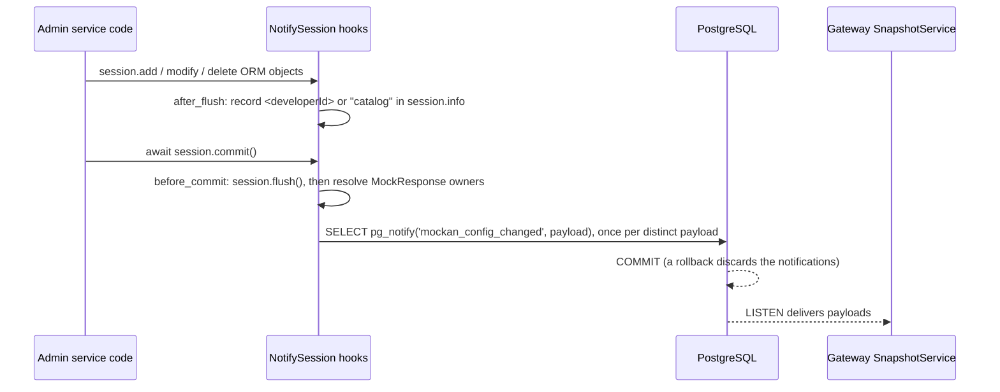

# Mockan Backend — Database

> **Summary:** how the PostgreSQL schema `mockan` is laid out, which deletes cascade, how a committed change reaches the Gateway (`pg_notify`), and the rules for migrations. The table list and columns are in [architecture §8](../agent/mockan-architecture.md#8-data-model); this file records what the code adds to it. Models: `server/src/mockan/infrastructure/db/models.py`.

## 1. Conventions

| Topic | Rule |
| --- | --- |
| Schema | Everything lives in schema `mockan`, including Alembic's `alembic_version` table. `migrations/env.py` creates the schema before migrating and restricts autogenerate to it (`include_name`). |
| Ids | `uuid` generated in the app with `uuid.uuid7()` (a Python default, applied **during the flush**, so a new object has `id is None` until then). Log tables use `bigint identity`. |
| Timestamps | `created_at`/`updated_at` are `timestamptz` with `server_default=now()` and `onupdate=now()`. `eager_defaults=True` on `Base` fetches them with `RETURNING`, so no lazy reload is needed on an async session. `audit_logs` is append-only and has only `timestamp`. |
| Enums | Stored as `varchar` plus a named `CHECK` (`ck_<table>_<column>`). The ORM maps them to the `StrEnum` classes in `mockan.domain.enums`, storing the enum **value** (`"Exact"`, `"stage"`). |
| JSON columns | `jsonb` with `'[]'` / `'{}'` server defaults: `allowed_origins`, `query_conditions`, `header_conditions`, `headers`, `extra_headers`, `changes`. |
| Relationships | `lazy="raise"`. Load with `selectinload(...)` explicitly; an accidental lazy load fails loudly instead of doing hidden I/O. |
| Extra CHECKs | `mock_rules.method` ∈ ANY + HTTP methods, `priority >= 0`; `mock_responses.status_code` 100–599, `delay_ms` 0–30000; `service_environments.timeout_seconds` 1–3600. They back up the Admin validation (never replace it). |

## 2. Foreign keys and delete policy

| FK | On delete | Why |
| --- | --- | --- |
| `service_environments.service_id` | CASCADE | A Service's environments go with it. |
| `developer_service_settings.developer_id` / `service_id` / `service_environment_id` | CASCADE | A deleted Service or environment makes the Developer fall back to the Service default (matches the Panel's MSW). |
| `mock_rules.service_id` | SET NULL | The scope is informational only (G-7, OQ-B1). |
| `mock_responses.rule_id` | CASCADE | Responses belong to their rule. |
| `mock_rules.active_response_id` | SET NULL | Circular with `mock_responses.rule_id`: created in the migration **after** both tables (`use_alter`). The Admin never leaves a rule without an active response (G-3). |
| `mock_rules.developer_id` | RESTRICT | A Developer with rules can't be deleted by accident. |
| `audit_logs.developer_id` | none | No FK, so history survives deleted Developers and entities. |

`developers.slug` is nullable and unique (several Developers may have no slug yet). `services.path_prefix` is unique as stored; the Admin additionally compares case-insensitively.

## 3. Change notification (D-07, FR-08)

- The hooks live on `NotifySession` (`infrastructure/db/notify.py`), the sync session class that `create_session_factory()` hands to every `AsyncSession`. Sessions built another way send nothing.
- **Payloads:** `developers` → its id; `mock_rules`, `developer_service_settings` → `developer_id`; `mock_responses` → the owning rule's `developer_id` (looked up at commit by `rule_id`); `services`, `service_environments` → `catalog`.
- Collecting in `after_flush` (not `before_commit`) means an explicit `await session.flush()` in service code can't hide a change. `before_commit` runs *before* the commit's own flush, so it flushes first.
- **Bulk `update()`/`delete()` statements skip the ORM events.** Call `notify.mark(session, developer_id)` (or `notify.mark(session, "catalog")`). `toggle-all` (B6) does.
- A rollback clears the collected payloads (`after_rollback`), so a failed attempt never leaks into the next transaction on the same session.

## 4. Migrations

- Create: `uv run alembic revision --autogenerate -m "<slug>"`, then **review the file by hand** (the policy in the plan). Files are named `YYYYMMDD_HHMM_<slug>.py` (`alembic.ini`).
- Known autogenerate trap: it inlines the circular FK `mock_rules.active_response_id` in `create_table`, which fails because `mock_responses` doesn't exist yet. `0001` creates that FK in a separate `op.create_foreign_key` after both tables; keep it that way if you regenerate.
- `alembic check` must show no drift. `tests/infrastructure/test_database.py` runs it, plus a downgrade → upgrade round trip.
- Apply: `uv run alembic upgrade head`. The Admin applies migrations on startup when `MOCKAN_MIGRATE_ON_STARTUP=true` (non-prod); shared environments use a migration job.
- `request_logs` (migration `0002`, B8a): `bigint identity` id, no FKs (like `audit_logs`), indexes `(developer_id, id)` and `(timestamp)`. `path` is the path **after the slug**, as rules see it. Headers and the 16 KB body samples are **masked before insert** (NFR-07; JSON by key, even when cut at 16 KB; form bodies by field; binary, encoded and non-text bodies are not stored). Retention: 7 days and the newest 5,000 rows per Developer, deleted by a loop in the Gateway (an advisory lock lets one Gateway do it).
- **`pg_notify('mockan_request_logged', '<developerId>:<maxId>')`** is sent by the Gateway's writer in the same transaction as each batch insert, once per Developer in the batch (D-19). Only the Admin's hub listens.

## 5. Test database

`tests/conftest.py` starts one Testcontainers PostgreSQL 18 per session, applies `alembic upgrade head`, and yields its `postgresql+asyncpg://` URL (`pg_container`). Each test gets a fresh `engine` and `session_factory`; the engine fixture truncates every `mockan` table afterwards, so tests don't share state. Mark such tests `@pytest.mark.db`.
