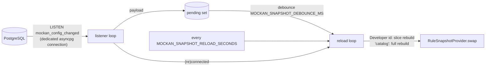

# Mockan Backend — Gateway

> **Summary:** what the data plane does with a request today, in the order it does it, and the decisions that are not obvious from the code. The system-level design is [architecture §6](../agent/mockan-architecture.md#6-request-lifecycle-gateway); this file records what was built and the gaps settled in the [implementation plan](implementation-plan.md) (G-6, G-7, G-8).

## 1. Pipeline

Pure ASGI middleware (never `BaseHTTPMiddleware`), outermost first. `create_app()` in `gateway/app.py` adds them in reverse because Starlette makes the last-added outermost.

| # | Step | File | What it does |
| --- | --- | --- | --- |
| 1 | Request-log capture | `middleware/request_log_capture.py` | Tees at most 16 KB of each body (wrapping `receive`/`send`, nothing else buffered) and, when the response ends, `put_nowait`s one `LogEntry` on a bounded queue (full = drop and count). Source comes from the response's `X-Mockan-Source`, the Service from the context. Only requests that reached a Developer are logged: unknown slugs, preflights and health are not. A background `RequestLogWriter` (`infrastructure/request_log.py`) batches, masks, inserts and notifies; the request path never touches the database (D-18). |
| 2 | CORS | `middleware/cors.py` | Answers preflights with `204`, adds CORS headers to every response (§3). |
| 3 | Error boundary | `middleware/error_boundary.py` | An unexpected exception becomes a `500 internal_error` problem that still passes through CORS. A response already started is not rewritten. |
| 4 | Developer resolution | `middleware/developer_resolution.py` | First path segment → `Developer`; `404 developer_not_found` for unknown, disabled, empty or reserved slugs. Stores a `MockanContext` in `scope["state"]["mockan"]`. |
| 5 | Mock matching | `middleware/mock_matching.py` | `match_request` on the path **after the slug**; a hit answers with the rule's active response. |
| 6 | Proxy route | `proxy/forwarder.py` (`proxy_http`) | Resolves the Service (`502 service_not_resolved` when none), then streams the request upstream and the response back (§5). |

Health routes (`/_mockan/health/live|ready`) are dispatched by FastAPI **before** step 4: steps 2–5 skip those two exact paths. Any other path under `/_mockan/` goes through resolution and gets `404` (reserved slug).

**WebSockets bypass this HTTP pipeline** (every middleware passes a non-`http` scope straight through). `proxy/websocket.py` resolves the Developer and the Service itself with the same functions (`context.find_developer`, `resolve_service`); there is no mock matching for WebSockets (§6).

The snapshot is read **once per request** (`context.snapshot_for`, first caller wins) and that object is used for the whole request, so a swap mid-request can't mix two states.

## 2. Responses and `X-Mockan-Source` (PR-09, G-6)

Every response carries the header.

| Response | Value | Notes |
| --- | --- | --- |
| Mocked | `mock` + `X-Mockan-Rule-Id` | |
| Proxied | `proxy` | Any upstream `X-Mockan-Source` / `X-Mockan-Rule-Id` is dropped first. |
| Mockan problem (any `4xx/5xx` Mockan made) | `error` | `application/problem+json`, `Cache-Control: no-store`. |
| Mockan-answered preflight | `mock` | `TODO(OQ-B2)` |
| Health | `mock` | Same reasoning as the preflight, `TODO(OQ-B2)`. |

### Problem codes (arch §14 rule 8; all from `ErrorCode`)

| Code | Status | When |
| --- | --- | --- |
| `developer_not_found` | 404 | Unknown, disabled, empty or reserved slug. |
| `service_not_resolved` | 502 | No Service prefix matches, or the Service has no usable environment. |
| `upstream_unreachable` | 502 | Connection refused/reset, DNS failure, TLS failure, any other transport error, an invalid base URL, **or a destination outside `MOCKAN_ALLOWED_UPSTREAM_HOSTS`** (also logged as `upstream_host_not_allowed`). |
| `upstream_timeout` | 504 | No answer within the environment's `timeout_seconds` (§5). |
| `mock_render_failed` | 500 | B8c. |
| `internal_error` | 500 | Unhandled exception (details are logged, never returned). |

Every problem body has `type`, `title`, `status`, `code`, `detail`, plus `developer` (the slug as sent, `""` when absent) and `path` (PR-16).

## 3. CORS (D-13, PR-03)

- **Preflight** = `OPTIONS` with `Access-Control-Request-Method`. Always `204`, never forwarded, never answered by a rule. Allowed origin → `Allow-Origin` (echo), `Allow-Credentials: true`, `Allow-Methods` (the requested method), `Allow-Headers` (the requested headers), `Max-Age: 600`. A disallowed origin still gets `204`, without those headers (the browser blocks it).
- **Other responses** (mock, proxied, problem): any `Access-Control-*` header from a mock or an upstream is **removed** and Mockan's added: `Allow-Origin` (echo), `Allow-Credentials: true`, `Expose-Headers: X-Mockan-Source, X-Mockan-Rule-Id` — only for an allowed origin. `Vary: Origin` is always merged into any existing `Vary`.
- **Whose origins:** the Developer's `allowedOrigins`; an unknown slug falls back to `MOCKAN_DEFAULT_ALLOWED_ORIGINS`, so error responses stay readable by the browser.
- **Origin matching is not a glob.** `domain.validation.origin_is_allowed` compares scheme, host and port separately: `http://localhost:*` matches `http://localhost:5173` and `http://localhost`, but never `http://localhost:1.evil.com`. A host may be `*.example.com` (subdomains only, never the apex).

## 4. Mock responses (PR-06)

- Delay uses `asyncio.sleep` (never blocks the loop; tested with a concurrent fast request).
- The rule's `contentType` is authoritative. A mock cannot set `Content-Length`, `Transfer-Encoding`, `Connection`, `Keep-Alive`, `Content-Type`, or any hop-by-hop header, and it cannot override `X-Mockan-*`. Headers whose name or value contains CR, LF or NUL are dropped (header injection; the Admin rejects them on save too, B6).
- `1xx`, `204` and `304` send no body.
- The request body is never read for a mocked response.
- **Templated bodies (PR-19, `bodyMode: Template`).** The body is a Jinja2 **sandbox** template compiled when the snapshot is built (`matching/templating.py`; a rule whose template doesn't compile is skipped and logged, like any bad row) and rendered per request on the event loop after the delay. Context: `request.method`, `request.path` (after the slug), `request.query` (first value per name), `request.query_all` (lists), `request.headers` (lower-case names), `route.<name>` (the `{name}`/`{*name}` parameters of a Template rule or the named groups of a Regex rule) and `fake.<generator>()` (a curated Faker whitelist: `name`, `email`, `uuid4`, `random_int`, `city`, `text`, ...; anything else is an error). **A missing variable is an error, not an empty string.** Failure (undefined variable, a runtime error, output over 1 MB, `range()` over 1,000, a sandbox violation) is `500 mock_render_failed` with the reason in `detail`, `X-Mockan-Source: error`, and a `mock_render_failed` log line; the Developer sees which rule and why. `1xx/204/304` skip rendering. `autoescape` is off (JSON, XML, text). Static bodies are never interpreted. **Limit to know:** rendering is synchronous on the loop; a template with nested loops that produce no output can spin until the process is restarted (range and output caps bound the usual cases; templates are written by signed-in colleagues, not the public).
- **G-7:** `mock_rules.service_id` is informational only and does not filter matching (`TODO(OQ-B1)`), because matching runs before Service resolution.

## 5. Proxy (D-15, PR-02, PR-03, PR-04, PR-15, NFR-01, NFR-04)

`gateway/proxy/`: `transform.py` (pure functions on header lists, unit-tested without I/O), `forwarder.py` (HTTP), `websocket.py` (§6).

**Flow** (`ProxyForwarder.forward`):

1. `plan()` resolves the Service, builds the upstream URL (§5.1), re-checks the destination against `MOCKAN_ALLOWED_UPSTREAM_HOSTS` and transforms the request headers. It does no I/O. A failure here is a `ProxyError` that becomes a problem response.
2. One `httpx.AsyncClient` request with `stream=True`. The request body is `request.stream()` (read from ASGI `receive` as it is sent), but only when the request has a body (`Content-Length` > 0 or `Transfer-Encoding`): a `GET` must not turn into a chunked request.
3. The response goes back as an `UpstreamResponse` (a `StreamingResponse` over `aiter_raw()`): bytes are passed through raw, so `Content-Encoding` is preserved and nothing is decompressed. Its `__call__` closes the upstream response in a shielded `finally`, however the stream ends.

### 5.1 What `transform.py` does (arch §6.3), and where the build goes further

| Concern | Built behaviour |
| --- | --- |
| Path | The client's **raw** path is reused (minus slug and, with `StripPrefix`, the prefix), so `%2F` and other encodings arrive byte for byte. It is used only when it decodes to exactly what `resolve_service` computed from the decoded path; otherwise the decoded path is re-encoded. httpx collapses `.`/`..` segments (standard URL normalisation). |
| Query | The raw query string, never re-encoded. |
| `Host` | The upstream's `host[:port]` from the environment's base URL. |
| Hop-by-hop | `Connection`, `Keep-Alive`, `Proxy-*`, `TE`, `Trailer`, `Transfer-Encoding`, `Upgrade` and anything named in `Connection`, both ways. Also dropped on requests: `Expect` (the ASGI server answers it). Dropped on responses: `Date` and `Server` (Uvicorn adds its own; an upstream copy would be a duplicate header). |
| `X-Forwarded-*` | `Proto`, `Host` (the client's `Host`) and `Prefix` (`/{slug}`) are **replaced**, never trusted from the client. `For` extends the incoming chain with the client address, unless the chain already ends with it (Uvicorn's `--proxy-headers` resolves `scope["client"]` from that chain). |
| `X-Mockan-Developer`, `ExtraHeaders` | Added; `ExtraHeaders` replace any same-named header the client sent. |
| `Origin` / `Referer` | Unchanged, unless the Service has `RewriteOrigin`: then, when present, `Origin` becomes the upstream origin and `Referer` its root. |
| `Location` | Rewritten on **any** status (a `201 Created` points at the upstream just as a `302` does): absolute URLs on the upstream origin, protocol-relative ones and path-absolute ones (`/x`). Path-relative ones and other origins are untouched. |
| `Set-Cookie` | `Domain` removed; `Path` moved under the slug, no `Path` → `/{slug}`. Both cookie paths and `Location` use the inverse of the request mapping: `/{slug}` + (the Service prefix when `StripPrefix`) + the path below the environment's base-URL path. So with `StripPrefix`, `Path=/x` becomes `/{slug}/limsa/x`. `TODO(OQ-02)`: assumes bearer tokens; a `__Host-` cookie needs `Path=/` and can't survive a path prefix. |
| Upstream CORS, `X-Mockan-*` | Stripped; the CORS middleware adds Mockan's (§3) and `X-Mockan-Source: proxy` is set. |
| `Content-Length`, `Content-Encoding` | Kept: they describe the raw body that is passed through. |

### 5.2 Client, timeouts and failures

- **One client per process** (`create_http_client`): `follow_redirects=False`, `http2=False`, no overall timeout (set per request), pool 512 connections / 128 kept alive. `trust_env=False`: the Gateway reaches upstreams directly whatever `HTTP(S)_PROXY` the host exports. TLS uses httpx's default CA bundle; a private-CA setting is not part of Phase 1.
- **Timeout** = `ServiceEnvironment.timeout_seconds` as httpx's connect, read, write and pool timeout. It bounds the *silence* between bytes, not the total duration: a long download that keeps flowing never times out, a stream that goes quiet for longer than the timeout is cut.
- `httpx.TimeoutException` → `504 upstream_timeout`; any other `httpx.TransportError` (connect, TLS, protocol, read/write) → `502 upstream_unreachable`. The destination and scheme are validated with the same parser httpx will connect with (`http://allowed.test@evil.test/` is judged by `evil.test`), and refused before any connection (`502 upstream_unreachable`, logged `upstream_host_not_allowed`).
- **Client disconnects:** while uploading, the request is abandoned (answered `499`, which nobody reads); while downloading, the stream is cancelled and the upstream response closed, so a closed SSE tab ends the upstream stream.
- **Upstream dies after the headers:** `upstream_stream_failed` is logged and the connection is dropped, so the client sees an error instead of a silently short body.
- **Limit:** HTTP/1.1 through httpx is half-duplex: the whole request body is sent before the response is read. Bidirectional streaming over one HTTP request is not supported; WebSockets are (§6).

## 6. WebSocket bridge (D-15)

`proxy/websocket.py`. The route runs outside the HTTP middleware (§1), so it resolves the Developer and the Service itself.

1. Developer (`find_developer`), then `ProxyForwarder.plan(..., websocket=True)`: same Service resolution, allowlist and header transform as HTTP, minus the handshake headers (`Sec-WebSocket-*`, `Connection`, `Upgrade`): the upstream hop negotiates its own.
2. Connect to `ws(s)://upstream` **before accepting** the browser: `websockets.connect` with the transformed headers, the client's subprotocols, `Origin` through its `origin=` argument, the browser's `User-Agent` (the library's own is disabled), `proxy=None` and the Service timeout as `open_timeout`.
3. Accept the browser's socket with the **subprotocol the upstream chose**, then pump frames both ways until either side closes. Text stays text and binary stays binary; messages up to 16 MiB (Uvicorn's own limit; the library's 1 MiB default would close big frames).

**Refusals happen before the upgrade**, as real HTTP responses (the `websocket.http.response` ASGI extension, which Uvicorn supports; a server without it turns the refusal into a plain `403`):

| Situation | Response |
| --- | --- |
| Unknown or disabled Developer | `404 developer_not_found` problem |
| No Service for the path | `502 service_not_resolved` problem |
| Host not allowed, unreachable, bad handshake | `502 upstream_unreachable` problem |
| No answer within the timeout | `504 upstream_timeout` problem |
| The upstream refuses the upgrade (`401`, `404`...) | Its status, headers (transformed as in §5.1) and body, with `X-Mockan-Source: proxy` |

**Close codes travel both ways.** The code and reason of whichever side closes first are sent to the other. Codes that can't be put on the wire are mapped: `1005` (none) → `1000`; browser `1006` (dropped) → upstream `1001`; upstream `1006` (connection lost) → browser `1011`.

No CORS headers: browsers don't apply CORS to WebSockets. `Origin` is forwarded to the upstream, which decides.

## 7. Snapshot service (D-07, FR-08, PR-07)

`gateway/snapshot_service.py`, started and stopped in the app's lifespan (skipped when a `snapshot_provider` is injected, which is how tests avoid the database).

- A payload that is a Developer id rebuilds that Developer's slice (`load_developer` + `with_developer_slice`); `catalog` (or a snapshot that never loaded) rebuilds everything. Each reload runs in one `REPEATABLE READ` transaction, so its queries see one consistent state.
- **Missed notifications:** a full reload runs on every (re)connect, and every `MOCKAN_SNAPSHOT_RELOAD_SECONDS` (default 60) as a safety net.
- **Failure handling:** a failed reload keeps the last snapshot, sets `degraded`, and retries with exponential backoff (0.5 s doubling, capped at 30 s). The listener reconnects with the same backoff.
- **`degraded`** = the LISTEN connection is down **or** the last reload failed. It clears when both are healthy again.
- The listener's connection has `application_name = mockan-gateway-listener` (visible in `pg_stat_activity`).
- The shared `httpx.AsyncClient` and the `ProxyForwarder` are created in the same lifespan (`app.state.http_client`, `app.state.forwarder`) and closed on shutdown, also when a `snapshot_provider` is injected.

## 8. Health (G-8, PR-17)

| Route | Response |
| --- | --- |
| `GET /_mockan/health/live` | Always `200 {"status":"live"}`. |
| `GET /_mockan/health/ready` | `503 {"status":"starting"}` until the first snapshot loads. Afterwards `200 {"status":"ready"\|"degraded","snapshotAgeSeconds":n}`. A degraded Gateway stays in rotation because it keeps serving the last good rules. |

## 9. Performance notes

- `match_request` with 500 rules for one Developer (`server/bench/match_bench.py`, 4 match types mixed): p95 ≈ 0.04 ms for a miss and for hits (target < 0.2 ms). A per-rule `literal_prefix` pre-filter rejects most rules with one `startswith` before their matcher runs; without it a miss cost ≈ 0.18 ms, dominated by RE2's per-call overhead. Unanchored regexes get no pre-filter, so a Developer with hundreds of them pays ≈ 1.2 µs per rule.
- **Proxy overhead (NFR-01)**, `server/bench/proxy_overhead.py` (manual, not a CI gate): gateway and upstream in separate Uvicorn processes (`uvloop` + `httptools`), the same GET sent directly and via the Gateway over keep-alive connections, 3000 requests per cell, 2026-10-04 on the development machine. Target: p95 delta ≤ 10 ms.

  | Path | Concurrency | Direct p50 / p95 (ms) | Via Gateway p50 / p95 (ms) | p95 delta (ms) |
  | --- | --- | --- | --- | --- |
  | `/status/200` | 1 | 0.72 / 0.90 | 1.55 / 1.87 | 0.97 |
  | `/status/200` | 16 | 11.88 / 17.81 | 15.57 / 22.37 | 4.57 |
  | `/echo?x=1` | 1 | 0.77 / 0.88 | 1.63 / 2.00 | 1.12 |
  | `/echo?x=1` | 16 | 12.22 / 18.45 | 16.49 / 25.29 | 6.84 |

  The proxy adds about 1 ms when idle. The 16-way rows are dominated by queueing in single-threaded processes, so they are a ceiling for one Gateway process, not a per-request cost; Gateway replicas (NFR-03) scale it out.
- **Template rendering** (`server/bench/template_bench.py`, 5000 renders each after compile, 2026-10-05, development machine): route + query JSON p50 0.007 ms / p95 0.008 ms; a person with 8 `fake.*` calls p50 0.41 ms / p95 0.48 ms; a 50-row list with 2 generators per row p50 4.8 ms / p95 5.1 ms. Cost is dominated by Faker (≈ 50 µs per call), so a template with ~100 fake values blocks the loop for ~5 ms; keep large generated lists modest.
- **Memory (NFR-04):** with Gateway, upstream and client in one process, a 10 MB upload plus a 10 MB download grew the resident set by ≈ 9 MB, and a 50 MB pair by ≈ 8 MB: bounded and independent of the payload size. `tests/gateway/test_proxy.py` asserts < 20 MB for 10 MB, and fails when either body is buffered (checked by making the forwarder buffer on purpose).

## 10. Open-question markers

| ID | Where | Default |
| --- | --- | --- |
| OQ-B1 | `matching/` (G-7) | `service_id` is informational. |
| OQ-B2 | `middleware/cors.py`, `health.py`, `problems.py` | `X-Mockan-Source`: `error` for problems, `mock` for preflight and health. |
| OQ-02 | `proxy/transform.py` (`rewrite_set_cookie`) | Resolved: apps use bearer tokens. `Set-Cookie` is still rewritten as in §5.1; `__Host-` cookies are unsupported. |
| OQ-B3 | `matching/compile.py` | Regex matches the original-case path. |
| OQ-B5 | `matching/matcher.py` | `HEAD` does not match a `GET` rule. |
